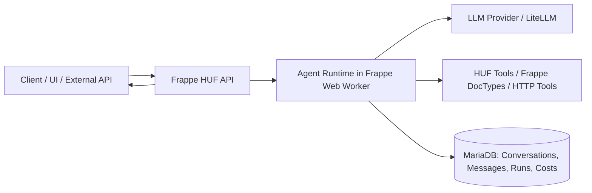
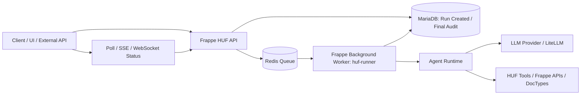
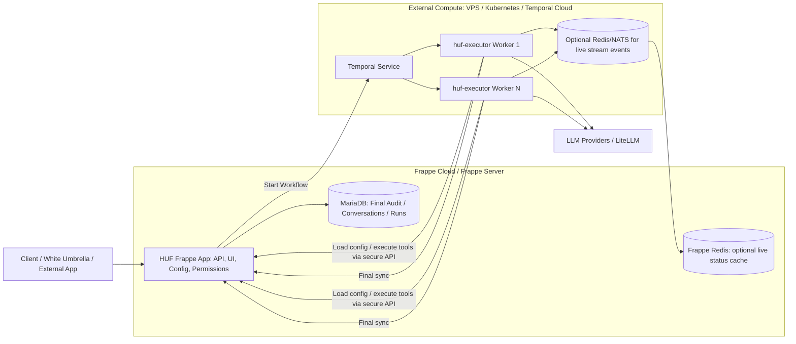
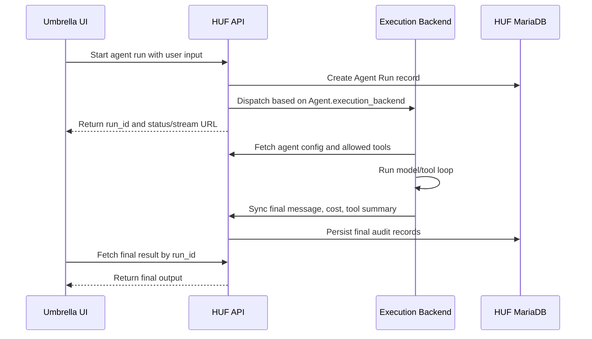
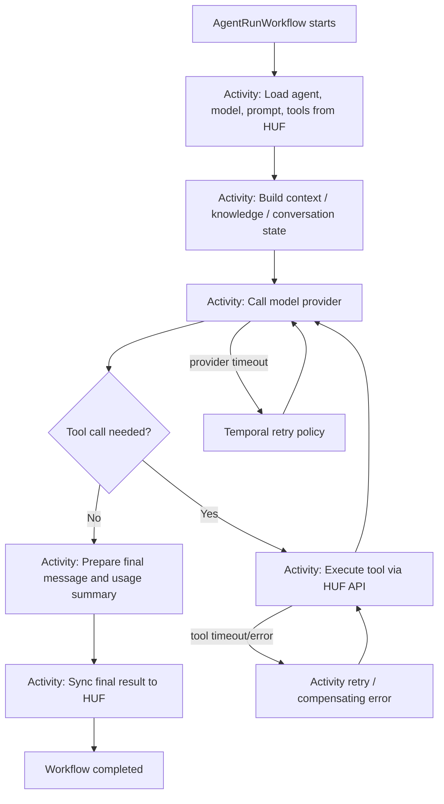

# Scaling HUF: Execution Backends, Deployment Modes, and Temporal Strategy

_Last updated: 2026-05-24_

## 1. Problem definition

HUF is evolving from a Frappe-native AI agent runtime into a broader AI execution layer for products, internal copilots, scheduled agents, document-triggered automation, tool execution, and customer-facing AI systems.

The current direct execution model is simple and useful: a request enters Frappe, HUF loads the agent, builds the prompt, calls the provider, executes tools, stores messages/runs/tool logs in MariaDB, and returns the result. This works well for small and medium workloads.

The scaling problem appears when HUF is used for:

- thousands of parallel customer-facing users;
- long-running agent workflows;
- model/tool loops that may take many seconds or minutes;
- heavy streaming traffic;
- document-event or scheduled trigger bursts;
- multi-agent chains;
- high-frequency tool events and partial run logs;
- products that need fast response while still preserving auditability.

If every prompt fragment, streamed token, tool event, message, and run state is synchronously written through the normal Frappe/MariaDB request path, HUF risks creating unnecessary pressure on:

- Frappe web workers;
- MariaDB write throughput;
- Redis queue contention;
- request timeouts;
- user-facing latency;
- deployment flexibility.

The goal is not to remove MariaDB or Frappe from HUF. The goal is to separate the hot execution path from the durable control/audit path.

The desired principle is:

> Frappe remains the control plane and source of business truth. Execution can move through different backends depending on scale, latency, durability, and operational requirements.

---

## 2. Core design principle

HUF should support multiple execution backends behind one common agent API.

```text
HUF Agent
  └── execution_backend
        ├── frappe_direct
        ├── frappe_queue
        └── temporal
```

All three modes should share the same conceptual contract:

- same Agent configuration;
- same Provider/Model configuration;
- same Prompt Template logic;
- same tool registry;
- same permission model;
- same final audit records;
- same cost and feedback records;
- same public API shape as much as possible.

The execution backend should decide how the run is performed, not what the agent means.

---

## 3. Mode 1: Frappe Direct API

### What it is

Frappe Direct is the current simplest mode. The HTTP request is handled by Frappe, the agent runs inside the request/response path, and the result is returned immediately.

### Deployment diagram


```mermaid
flowchart LR
    User["Client / UI / External API"] --> API["Frappe HUF API"]
    API --> Agent["Agent Runtime in Frappe Web Worker"]
    Agent --> Provider["LLM Provider / LiteLLM"]
    Agent --> Tools["HUF Tools / Frappe DocTypes / HTTP Tools"]
    Agent --> DB[("MariaDB: Conversations, Messages, Runs, Costs")]
    API --> User
```

### When to use it

Use this mode for:

- simple chat agents;
- admin/internal tools;
- low-volume environments;
- local development;
- debugging agent behavior;
- short-running runs;
- demos where operational simplicity matters more than scale.

### Example usage

A system administrator opens the HUF UI and tests an HR policy assistant. The agent loads a few knowledge chunks, generates a response, writes the message/run to MariaDB, and returns the final answer in the same request.

### API behavior

```http
POST /api/method/huf.run_agent
```

Typical behavior:

```json
{
  "status": "completed",
  "execution_backend": "frappe_direct",
  "message": "Final assistant response"
}
```

### How it helps

- lowest operational complexity;
- no extra infrastructure;
- easiest to debug;
- ideal default for development and small installations.

### Limitation

This mode should not be the primary path for high-volume customer-facing workloads, because the Frappe web request remains tied to the full LLM/tool execution lifecycle.

---

## 4. Mode 2: Frappe Redis Queue / Background Job

### What it is

Frappe Queue mode keeps execution inside the Frappe app and bench environment, but moves long-running work outside the web request. The API creates a run record, enqueues work into Redis/RQ, and returns a `run_id` quickly. A background worker performs the actual agent execution and syncs the final result back to HUF records.

### Deployment diagram


```mermaid
flowchart LR
    User["Client / UI / External API"] --> API["Frappe HUF API"]
    API --> DB[("MariaDB: Run Created / Final Audit")]
    API --> Redis[("Redis Queue")]
    Redis --> Worker["Frappe Background Worker: huf-runner"]
    Worker --> Agent["Agent Runtime"]
    Agent --> Provider["LLM Provider / LiteLLM"]
    Agent --> Tools["HUF Tools / Frappe APIs / DocTypes"]
    Worker --> DB
    User --> Status["Poll / SSE / WebSocket Status"]
    Status --> API
```

### When to use it

Use this mode for:

- normal production usage;
- medium traffic;
- scheduled agents;
- document-triggered agents;
- webhook-triggered agents;
- workflows that may take several seconds;
- cases where a quick `queued` response is better than holding the web request;
- teams that want scale improvement without running Temporal yet.

### Example usage

A CRM document is updated. HUF triggers a follow-up recommendation agent. The request or document event creates an Agent Run, enqueues the work, and returns immediately. The worker later writes the recommendation, run status, tool summary, and cost to MariaDB.

### API behavior

```http
POST /api/method/huf.run_agent
```

Response:

```json
{
  "run_id": "RUN-0001",
  "status": "queued",
  "execution_backend": "frappe_queue",
  "status_url": "/api/method/huf.get_agent_run_status?run_id=RUN-0001",
  "stream_url": "/huf/api/runs/RUN-0001/stream"
}
```

Status check:

```http
GET /api/method/huf.get_agent_run_status?run_id=RUN-0001
```

Final result:

```http
GET /api/method/huf.get_agent_run_result?run_id=RUN-0001
```

### How it helps

- removes long LLM/tool execution from Frappe web request workers;
- keeps deployment simple;
- uses infrastructure already common in Frappe benches;
- supports retries through queue/job behavior;
- is enough for many production HUF installs.

### Limitation

Frappe Queue mode is still not a full durable workflow engine. If the use case needs long-running multi-step orchestration, cancellation, resume-after-crash semantics, workflow history, or very high parallelism, Temporal becomes a better fit.

---

## 5. Mode 3: Temporal Executor

### What it is

Temporal mode introduces a separate `huf-executor` runtime that runs agent workflows as Temporal workflows and activities. Frappe HUF remains the control plane, configuration layer, API gateway, permission layer, and final audit store. Temporal coordinates durable execution outside the Frappe request/worker model.

Temporal production architecture requires application workers plus a production-ready Temporal Service. Temporal can be used through Temporal Cloud or self-hosted infrastructure. The self-hosted path requires a separate deployment plan covering service deployment, namespaces, security, monitoring, visibility, retention, and upgrade process.

### Deployment diagram: Frappe Cloud + external Temporal


```mermaid
flowchart LR
    subgraph FC["Frappe Cloud / Frappe Server"]
        HUF["HUF Frappe App: API, UI, Config, Permissions"]
        DB[("MariaDB: Final Audit / Conversations / Runs")]
        HUFRedis[("Frappe Redis: optional live status cache")]
    end

    subgraph EXT["External Compute: VPS / Kubernetes / Temporal Cloud"]
        Temporal["Temporal Service"]
        Executor1["huf-executor Worker 1"]
        ExecutorN["huf-executor Worker N"]
        Stream[("Optional Redis/NATS for live stream events")]
    end

    User["Client / White Umbrella / External App"] --> HUF
    HUF -->|"Start Workflow"| Temporal
    Temporal --> Executor1
    Temporal --> ExecutorN
    Executor1 -->|"Load config / execute tools via secure API"| HUF
    ExecutorN -->|"Load config / execute tools via secure API"| HUF
    Executor1 --> Provider["LLM Providers / LiteLLM"]
    ExecutorN --> Provider
    Executor1 --> Stream
    ExecutorN --> Stream
    Stream --> HUFRedis
    Executor1 -->|"Final sync"| HUF
    ExecutorN -->|"Final sync"| HUF
    HUF --> DB
```

### Why Temporal is outside Frappe Cloud

Treat Frappe Cloud as the managed Frappe application environment. HUF can run there as a normal Frappe app, store configuration, expose APIs, and persist final records. Temporal should be deployed separately unless the hosting environment explicitly supports running and operating Temporal Service and its workers as first-class long-running services.

Practical deployment options:

1. HUF on Frappe Cloud + Temporal Cloud + external `huf-executor` workers.
2. HUF on Frappe Cloud + self-hosted Temporal on Kubernetes/VPS + external workers.
3. Fully self-hosted HUF + self-hosted Temporal + worker cluster.

For early enterprise deployments, option 1 is operationally cleaner. For cost/control-sensitive deployments, option 2 or 3 may be preferred.

### When to use it

Use Temporal mode for:

- thousands of parallel users;
- long-running customer-facing agent flows;
- multi-step workflows;
- model/tool loops with retries;
- workflows that need cancellation, timeout, resume, and audit history;
- complex trigger bursts;
- multi-agent orchestration;
- enterprise deployments where execution reliability matters more than deployment simplicity.

### Example usage

A customer-facing travel or business-service product calls HUF to start a complex agent run. The agent must collect requirements, call multiple tools, search knowledge, call external APIs, retry slow providers, stream progress, and finally write a structured result. HUF starts a Temporal workflow and immediately returns a `run_id`. The `huf-executor` workers complete the workflow outside Frappe Cloud and sync the final result back to HUF.

### API behavior

```http
POST /api/method/huf.run_agent
```

Response:

```json
{
  "run_id": "RUN-0002",
  "workflow_id": "huf-agent-run-RUN-0002",
  "status": "queued",
  "execution_backend": "temporal",
  "status_url": "/api/method/huf.get_agent_run_status?run_id=RUN-0002",
  "stream_url": "/huf/api/runs/RUN-0002/stream"
}
```

Cancel:

```http
POST /api/method/huf.cancel_agent_run
```

Retry or resume should be handled by Temporal workflow/activity policy, while HUF exposes a user-facing status and audit record.

### How it helps

- decouples high-scale execution from Frappe web and worker limits;
- allows horizontal scaling of executor workers;
- gives durable workflow execution;
- supports workflow-level retries, activity-level retries, cancellation, timeouts, and recovery;
- allows HUF to become a control plane while execution scales independently.

---

## 6. White Umbrella / Umbrella usage logic

For this document, `White Umbrella` or `Umbrella` means a customer-facing product/application layer that uses HUF agents behind an API. Umbrella should not directly own the agent runtime, model keys, prompt governance, tool permission model, or final audit logic. HUF should own those concerns.

Umbrella should do:

- collect user input;
- manage product-specific UI/UX;
- call HUF agent APIs;
- show streamed/progress status;
- render final output;
- maintain its own product/session identifiers;
- pass the HUF `conversation_id`, `run_id`, or external reference IDs when needed.

HUF should do:

- select agent/model/provider;
- apply prompt templates;
- enforce permissions;
- run tools;
- execute the agent using the selected backend;
- log runs, messages, costs, tool summaries, and feedback;
- expose status and result APIs.

### Recommended Umbrella execution mode

Umbrella should not use one mode forever. It should route by workload:

| Umbrella workload | Recommended HUF mode | Why |
|---|---|---|
| Admin testing / internal operator chat | `frappe_direct` | simple and easy to debug |
| Normal customer chat with moderate traffic | `frappe_queue` | avoids holding web requests |
| Long-running itinerary / assistance / multi-tool flow | `temporal` | durable and horizontally scalable |
| High-volume public traffic | `temporal` | isolates customer load from Frappe app limits |
| Fire-and-forget background enrichment | `frappe_queue` first, `temporal` later | queue is enough unless workflow durability matters |

### Umbrella example flow


```mermaid
sequenceDiagram
    participant U as Umbrella UI
    participant H as HUF API
    participant E as Execution Backend
    participant D as HUF MariaDB

    U->>H: Start agent run with user input
    H->>D: Create Agent Run record
    H->>E: Dispatch based on Agent.execution_backend
    H-->>U: Return run_id and status/stream URL
    E->>H: Fetch agent config and allowed tools
    E->>E: Run model/tool loop
    E->>H: Sync final message, cost, tool summary
    H->>D: Persist final audit records
    U->>H: Fetch final result by run_id
    H-->>U: Return final output
```

Recommended first setup for Umbrella:

```text
Development / demo: frappe_direct
Early production: frappe_queue
Scaled production: temporal
```

---

## 7. Data persistence strategy

HUF should avoid writing every small event directly to MariaDB in high-scale modes.

### Write immediately to MariaDB

- Agent Run created;
- user message accepted;
- final assistant message;
- final run status;
- final token and cost summary;
- tool call summary;
- critical error summary;
- feedback.

### Keep in hot/event layer first

- streamed tokens;
- partial status updates;
- intermediate tool progress;
- temporary retry logs;
- worker heartbeat;
- step-level debug events;
- large raw traces.

### Optional storage for raw traces

For enterprise debugging, raw workflow traces can be stored in object storage or a log/event store and linked from the HUF run record. MariaDB should keep compact audit records, not unbounded token/event firehose data.

---

## 8. Proposed HUF configuration model

Add or evolve settings like:

```text
Agent.execution_backend
- frappe_direct
- frappe_queue
- temporal

Agent.persistence_mode
- full
- summary
- final_only

Agent.streaming_mode
- none
- sse
- websocket
- external_stream

HUF Settings.default_execution_backend
HUF Settings.enable_temporal
HUF Settings.temporal_address
HUF Settings.temporal_namespace
HUF Settings.temporal_task_queue
HUF Settings.executor_auth_mode
```

The public API should remain stable. Backend routing should be internal.

---

## 9. Temporal app: what it should be

The Temporal app should be a separate Python service, tentatively named:

```text
huf-executor
```

It should not be a second HUF control plane. It should be an execution runtime.

### Responsibilities

- register Temporal workflows and activities;
- consume agent run workflows;
- fetch agent configuration from HUF;
- prepare prompt/context using HUF APIs or shared logic;
- call LiteLLM/providers;
- execute tools through secure HUF/Frappe APIs;
- emit progress events;
- handle retries/timeouts/cancellation;
- sync final result back to HUF;
- expose health/metrics endpoints.

### Non-responsibilities

- own user permissions;
- own Frappe business logic;
- bypass DocType permissions;
- directly mutate ERPNext/Frappe business tables;
- store final audit truth separately from HUF;
- duplicate HUF agent configuration.

### Suggested process model


```mermaid
flowchart TD
    Start["AgentRunWorkflow starts"] --> Load["Activity: Load agent, model, prompt, tools from HUF"]
    Load --> Context["Activity: Build context / knowledge / conversation state"]
    Context --> Model["Activity: Call model provider"]
    Model --> Decision{"Tool call needed?"}
    Decision -->|"Yes"| Tool["Activity: Execute tool via HUF API"]
    Tool --> Model
    Decision -->|"No"| Finalize["Activity: Prepare final message and usage summary"]
    Finalize --> Sync["Activity: Sync final result to HUF"]
    Sync --> Complete["Workflow completed"]

    Model -->|"provider timeout"| RetryModel["Temporal retry policy"]
    RetryModel --> Model
    Tool -->|"tool timeout/error"| RetryTool["Activity retry / compensating error"]
    RetryTool --> Tool
```

### Workflow candidates

```text
AgentRunWorkflow
TriggeredAgentRunWorkflow
FlowRunWorkflow
BulkEvaluationWorkflow
AgentConversationWorkflow
```

### Activity candidates

```text
load_agent_config
load_conversation_state
retrieve_knowledge_context
call_model
execute_tool
emit_run_event
sync_final_result
sync_error_result
calculate_usage_cost
```

---

## 10. Temporal build plan

### Phase A: Interface first

- Add execution backend abstraction inside HUF.
- Keep `frappe_direct` as existing behavior.
- Add normalized `run_id`, status, result, cancel APIs.
- Add run status model that works for all backends.

### Phase B: Frappe Queue backend

- Add `frappe_queue` dispatcher.
- Add queue names such as `huf_runner` and `huf_sync`.
- Add background worker functions.
- Add status polling and final sync.
- Add compact event buffering for stream/status.

### Phase C: Temporal proof of concept

- Create `huf-executor` Python package/service.
- Add Temporal Python SDK.
- Implement `AgentRunWorkflow` with simple model call.
- Start workflow from HUF API.
- Sync final result back to HUF.
- Deploy Temporal locally using `temporal server start-dev` for development.

### Phase D: Tool and streaming support

- Add tool execution activities.
- Add progress event publishing.
- Add cancellation.
- Add timeout and retry policy per activity type.
- Add final token/cost sync.

### Phase E: Production deployment

- Choose Temporal Cloud or self-hosted Temporal.
- Deploy `huf-executor` workers outside Frappe Cloud.
- Configure namespace, task queue, TLS/auth, secrets, and metrics.
- Add health checks and monitoring.
- Add release/versioning process for workflow changes.

### Phase F: Advanced scale

- Add worker autoscaling.
- Add multiple task queues by workload type.
- Add raw trace archival.
- Add bulk run/evaluation workflows.
- Add stage-wise cost and latency analytics.

---

## 11. Deployment comparison

| Mode | Infra required | Best for | Scale | Durability | Complexity |
|---|---|---|---|---|---|
| `frappe_direct` | Frappe only | dev, admin, simple chat | low | request-level | low |
| `frappe_queue` | Frappe + Redis workers | normal production async | medium | job-level | medium |
| `temporal` | Frappe + Temporal + executor workers | large-scale durable agents | high | workflow-level | high |

Recommended default:

```text
Default for HUF installs: frappe_queue
Simple/dev override: frappe_direct
Enterprise/high-scale option: temporal
```

---

## 12. Implementation notes for API compatibility

The public API should avoid exposing too much backend-specific behavior.

Preferred normalized response:

```json
{
  "run_id": "RUN-0003",
  "conversation_id": "CONV-0009",
  "status": "queued|running|completed|failed|cancelled",
  "execution_backend": "frappe_direct|frappe_queue|temporal",
  "status_url": "...",
  "stream_url": "...",
  "result_url": "..."
}
```

For direct mode, HUF may still include the final message immediately.

For queue and Temporal modes, HUF should return quickly and allow the client to poll or stream.

---

## 13. Final recommendation

HUF should implement all three modes as first-class execution backends.

The short-term path should be:

```text
1. Keep Frappe Direct for simple/dev usage.
2. Add Frappe Queue as the default async production backend.
3. Build Temporal Executor as the large-scale durable backend.
```

This gives HUF a clean growth path:

```text
single Frappe app → async Frappe AI runtime → distributed durable agent platform
```

That path protects HUF's Frappe-native strength while giving it a credible architecture for thousands of parallel users and complex long-running agent workflows.

---
---

# Part 2: Review and Updated Plan (2026-07-12)

_This section reviews Part 1 (written 2026-05-24, against develop @ `9d22bc9`) against the current codebase (~360 commits later) and replaces its build plan._

## 14. Current state audit

What actually exists today, versus what Part 1 proposed:

| Part 1 proposal | Status | Evidence |
|---|---|---|
| `execution_backend` abstraction (Phase A) | **Not started** | No `execution_backend` field or dispatcher anywhere |
| Normalized `run_id` / status / result / cancel APIs (Phase A) | **Not started** | `run_agent_sync` returns final output inline; no `get_agent_run_status`, no cancel endpoint |
| `frappe_queue` backend (Phase B) | **Partially grown organically** | Doc-event triggers enqueue after commit (`agent_hooks.py:121`), flow runs enqueue (`flow_api.py:409`), sub-agent lifecycle / summarization / auto-titling / webhooks all enqueue; realtime socket events for background runs exist |
| Dedicated queues (`huf_runner`, `huf_sync`) | **Not done** | 14 of 16 enqueue sites use `queue="default"`, 2 use `"long"` — agent runs compete with all other bench jobs |
| Temporal / `huf-executor` (Phases C–F) | **Not started** | Zero references in the codebase |
| Event-buffered persistence (`persistence_mode`) | **Not done** | Per-event writes plus scattered mid-run `commit()` calls (including a "force commit so enqueued jobs reach Redis" workaround) |

Things that changed since Part 1 that materially affect this strategy:

- **Sub-agent orchestration** now works by enqueueing the parent agent again with a `[SILENT_TRIGGER]` prompt after the child completes (`agent_integration.py:~1150`). This is an ad-hoc continuation system: fixed 300s timeouts, no depth limit, no run graph, no cancellation propagation. It is the strongest *future* argument for a durable workflow engine — and the strongest *current* argument that the run model needs cleanup first.
- **Streaming got heavy**: streaming tool results, context policies applied mid-stream, prompt-caching cost capture, auto-commits during streams. Each SSE chat holds a Frappe web worker for the whole run. This — not MariaDB write throughput — is the first concurrency ceiling HUF will actually hit.
- **`agent_integration.py` is a 2,031-line monolith** mixing HTTP concerns, conversation management, the model/tool loop, persistence, sub-agent lifecycle, and realtime publishing. No backend abstraction can be bolted on cleanly until the run loop is extracted.
- **`run_agent_sync` is `@frappe.whitelist(allow_guest=True)`** — a security and abuse-scaling problem that outranks any architectural scaling work.
- **The scheduler still runs agents inline** (`agent_scheduler.py:36` calls `run_agent_sync` directly in the scheduler tick), so one slow agent delays every scheduled agent behind it.

## 15. Critical review of Part 1

**What holds up:**

- The core principle — Frappe as control plane / source of truth, execution behind a pluggable backend — is correct and worth keeping.
- The persistence split (final audit records to MariaDB immediately; token/progress firehose to a hot layer) is correct, and the codebase currently violates it.
- The "interface first" ordering (normalized run API before any new backend) was the right call. It was also the step that got skipped.

**What doesn't hold up:**

1. **Temporal is over-weighted and premature.** Roughly half of Part 1 designs Temporal deployment, workflows, and activities for a system that has no run-status API, no dedicated queues, no load metrics, and a monolithic run loop. The `huf-executor` callback model ("executor fetches config and executes tools via secure HUF API") doubles the network surface, adds latency to every tool call, and — critically — breaks the current security model, where tools run with the calling user's Frappe permissions. An external executor needs service-auth + user impersonation, which is a security project of its own that Part 1 doesn't scope.
2. **It solves a hypothetical bottleneck and misses the real ones.** The observed pressure points are: SSE streams pinning web workers, the shared `default` queue, the inline scheduler, unbounded sub-agent recursion, guest-accessible run endpoints, and mid-transaction commits. None of those are fixed by Temporal; all are fixable within Frappe in weeks.
3. **No measurement anywhere in the plan.** There is no telemetry today (queue wait time, run duration, tokens/sec, concurrent streams). Choosing between `frappe_queue` and Temporal without numbers is guessing. The decision gate for Temporal must be evidence, not aspiration.
4. **`AgentConversationWorkflow` as a Temporal workflow candidate is a mistake.** Conversations are long-lived, user-paced entities; modeling them as running workflows invites unbounded workflow histories. Model *runs* as workflows, conversations as data.
5. **The doc ignores the migration cost of its own API change.** Moving chat from "response inline" to "run_id + poll/stream" touches the entire frontend service layer (`streamChatApi`, `chatApi`, chat socket hooks). That's real scope and should be phased.

## 16. Updated recommendation

Keep the three-backend vision as the north star, but invert the effort: **spend the next quarter making `frappe_queue` a real, first-class, measured backend — and defer Temporal until telemetry proves the queue backend insufficient.**

Priority order:

```text
0. Safety/hygiene fixes (days–2 weeks)      ← do regardless of any scaling plan
1. Run-model + normalized run API            ← the skipped Phase A; highest leverage
2. First-class frappe_queue backend          ← formalize what grew organically
3. Streaming off the web-worker path         ← the actual concurrency ceiling
4. Telemetry + load test                     ← decision gate
5. Temporal (only if the gate says so)       ← scoped-down version of Part 1
```

### Phase 0 — Hygiene (immediately, independent of everything else)

- Remove `allow_guest=True` from `run_agent_sync`; add rate limiting on public entry points.
- Dedicated queues: `huf_runner` (agent runs), `huf_sync` (post-run bookkeeping: titles, summaries, cost sync). Route all 16 enqueue sites accordingly, so agent load can be scaled/isolated per-bench without touching `default`.
- Scheduler enqueues to `huf_runner` instead of running agents inline.
- Sub-agent chains: add `parent_run_id` to Agent Run, enforce a max chain depth, make timeout configurable per agent.
- Audit and minimize mid-run `frappe.db.commit()` calls; commits inside a request/stream are a correctness hazard under load.

### Phase 1 — Run model and normalized API (the real Phase A)

- Extract the model/tool loop out of `agent_integration.py` into an engine module with **no HTTP/request coupling** — callable identically from a web request, an RQ job, or (later) a Temporal activity. This refactor is the prerequisite for every backend, and skipping it is why Phase A never happened.
- Agent Run gains a proper lifecycle: `queued → running → completed | failed | cancelled`, plus `execution_backend`, `queued_at`/`started_at`/`ended_at` (queue-wait telemetry falls out for free).
- New whitelisted APIs: `start_agent_run` (returns the normalized envelope from §12), `get_agent_run_status`, `get_agent_run_result`, `cancel_agent_run` (best-effort cooperative cancel for queue mode: a flag the run loop checks between model/tool steps).
- Keep `run_agent_sync` as a compatibility wrapper (direct backend, inline result) so nothing breaks.

### Phase 2 — First-class `frappe_queue` + streaming realignment

- `Agent.execution_backend` field: `frappe_direct` (default for chat) and `frappe_queue` (default for triggers, schedules, webhooks, flows, sub-agents). **Do not add a `temporal` option yet** — an enum value with no implementation behind it is a support liability.
- Progress/streaming for queued runs via `frappe.publish_realtime` over Socket.IO (the pattern already exists for background runs) — the worker publishes deltas/tool events; nothing extra is written to MariaDB mid-run. Keep SSE for the direct backend and as fallback.
- `persistence_mode` (`full | summary | final_only`) implemented as: final audit rows always written; intermediate tool-call detail written in one batch at run end (or not at all in `final_only`).
- Frontend: migrate chat to run-id-first + socket incrementally, direct/SSE path stays as fallback.

### Phase 3 — Measure, then decide

- Telemetry on Agent Run: queue wait, run duration, model latency, tool latency, token counts, concurrent-stream gauge. Surface on the dashboard.
- A repeatable load test (even a simple Locust/k6 script against a mock provider).
- **Temporal gate** — pursue Temporal only if, with tuned workers, we still see one of: (a) sustained queue wait beyond target at realistic worker counts, (b) real demand for resume-after-crash / multi-day runs / cross-run orchestration that RQ retries can't express, (c) a customer deployment that requires execution isolation from the Frappe bench.

### Phase 4 (conditional) — Temporal, scoped down

If the gate is met, build Part 1's Phases C–E with these corrections:

- Start with **Temporal Cloud** (option 1) only; self-hosting is a separate ops project.
- `AgentRunWorkflow` and `FlowRunWorkflow` only. Drop `AgentConversationWorkflow` (conversations are data, not workflows). Sub-agent chains become child workflows — this is where the current `[SILENT_TRIGGER]` hack finally gets a real home.
- Solve executor auth **first**: a service token + explicit user-impersonation model for tool execution, reviewed as a security change, before any workflow code. Tools must still execute under the initiating user's Frappe permissions.
- The engine module extracted in Phase 1 is reused as the activity body; the executor must not grow a second copy of run logic.

## 17. Concerns (short form)

- **Security before scale**: guest-accessible run endpoint and permission model around any future external executor are the two riskiest items in this whole document.
- **Refactor risk**: extracting the run loop from a 2k-line hot file with no test coverage on the execution path is the most likely place to break production behavior. Add characterization tests around `run_agent_sync` outputs/side-effects before moving code.
- **Frappe Cloud constraint**: if target deployments are Frappe Cloud, `frappe_queue` worker counts and Socket.IO behavior are the practical scaling levers; design Phase 2 to work within them.
- **Don't ship the enum before the engine**: exposing `temporal` in settings/UI before it works creates support debt.
- **MariaDB is not the bottleneck yet**: resist storage-layer re-architecture until telemetry says otherwise; batching tool-call writes is enough for now.

## 18. Summary

Part 1's destination is right; its route skipped the ground floor. The codebase has since grown an informal queue backend, an ad-hoc sub-agent continuation system, and heavier streaming — all pointing to the same conclusion: formalize the run model and the queue backend, instrument it, and let data decide whether Temporal is ever needed. Most HUF installs will likely never need more than a well-built `frappe_queue`.
