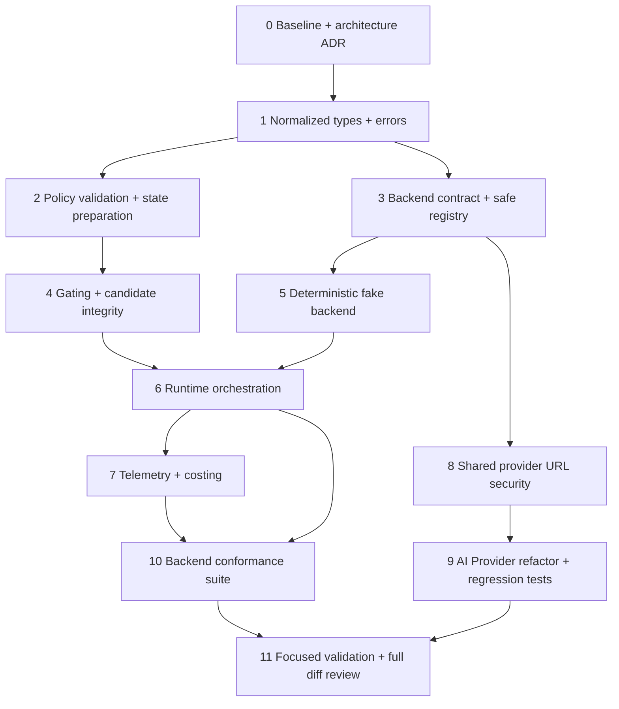

# HUF Decision Runtime — PR 1 Tracker

**Scope:** Decision Runtime foundation only; no Jev/OpenCode adapter, DocTypes, Playground, Flow, Agent, tool, or Procedure integration.

**Base:** `tridz-dev/huf`, branch `pre-develop`, verified `origin/pre-develop` at `43b69a0c6373d78e24b814be8ad546cfb250a4c3` (2026-09-22). Implementation branch: `codex/decision-runtime-pr1`.

## Dependency graph

## TODO nodes

| ID | Status | Scope / ownership | Acceptance |
|---|---|---|---|
| 0 | Complete | Verify branch/head, copy plans, inspect baseline, write findings + ADR | Clean isolated track from verified remote head; invariants and scope documented |
| 1 | Complete | `huf/ai/decision/types.py`, `errors.py`, `__init__.py` | Generic `select`/`judge`/`score`; typed request/answers/results; canonical model/provider/deployment metadata kept distinct |
| 2 | Complete | `policy.py`, `state.py` | Validate bounded HUF policy definitions; minimal-state serialization, modality and size checks; no arbitrary executable policy code |
| 3 | Complete | `registry.py`, `backends/base.py`, `hooks.py` | Adapter resolution only from installed-app hook map; stable backend protocol |
| 4 | Complete | `gating.py` | Validate candidate identity and result membership; confidence is evidence only; no authority expansion |
| 5 | Complete | `backends/fake.py` | Deterministic offline backend supports advertised primitives and batching |
| 6 | Complete | `runtime.py` | One request batches all questions; capability/state validation precedes dispatch; policy fallback distinct from deployment failover |
| 7 | Complete | `telemetry.py`, `costing.py` | Redacted structured telemetry, usage unknown distinct from zero, execution identity records class/family/model/provider/deployment/provider model ID |
| 8 | Complete | `huf/ai/provider_security.py` | Shared URL safety validator matches existing AI Provider constraints |
| 9 | Complete | `ai_provider.py`, focused tests | AI Provider uses shared helper without behavior regression; tests cover allowed/rejected URL classes |
| 10 | Complete | `tests/backend_conformance.py` + fake tests | Primitive integrity, batching, candidates, limits, modality, normalized errors/identity, telemetry/redaction |
| 11 | Complete | Validation and review | Relevant focused checks pass; diff contains no Jev, provider-model coupling, or integration leakage |

## Invariants carried into PR 1

- Permissions, allowlists, capability/modality constraints, budgets, availability, and binding constraints precede probabilistic decisions.
- The Decision Runtime can only return normalized, bounded recommendations; it cannot expand authority or invent candidates.
- Policy fallback occurs only after deployment resolution/failover is exhausted; PR 1 models this separately without implementing providers.
- Decision identity separates model class, family, canonical model/version, provider, deployment, and provider model ID.
- Procedures stay deterministic; no edits to ProcedureRuntime, Flow routing, model routing, Agent integrations, or tool discovery in this PR.
- Existing behavior stays Off/absent by default.

## Resume instructions

Read this tracker, `decision-runtime-baseline.md`, `decision-runtime.md`, and the three copied source plans. Continue with the first pending node whose dependencies are complete. Keep all feature code in the PR 1 worktree at `/Users/safwan/Code/Huf/huf-worktrees/decision-runtime-pr1`.

## Review constraints

- `CandidateSource` records claimed resolver provenance and runtime checks candidate membership; PR 1 does not prove that a domain authorization resolver produced the set. Future integration callers must obtain candidates from the named authoritative resolver before request construction.
- Structured state credential fields are redacted before provider dispatch and optional audit snapshots. Text-only backends reject typed image/audio/video structures even when the caller labels them as text.
- Policy fallback emits its own Decision Call only after the caller confirms deployment exhaustion; missing per-answer confidence yields an uncertain gate.
- Focused runtime tests and syntax compilation pass under Python 3.12 with a minimal Frappe logger stub. Full Frappe integration and unrelated provider DocType suites require the bench environment and have not been run here.
