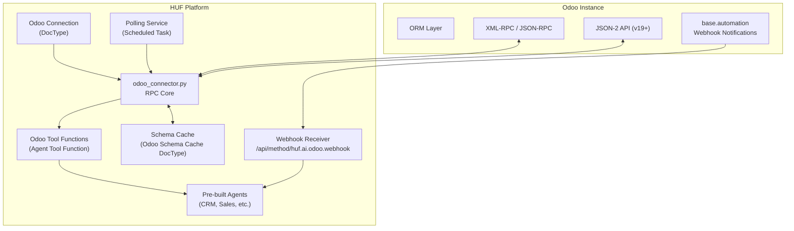

# feat: Odoo as a First-Class Integration Platform

> **Branch**: `feat/odoo-first-class-integration`
> **Goal**: Make HUF the #1 AI automation system for Odoo by providing native, deeply integrated Odoo connectivity — not as a generic HTTP wrapper, but as a purpose-built connector with schema awareness, multi-protocol support, and pre-built agents.

---

## Table of Contents

1. [Executive Summary](#1-executive-summary)
2. [Architecture Overview](#2-architecture-overview)
3. [Phase 1 — Odoo Connection DocType](#phase-1--odoo-connection-doctype)
4. [Phase 2 — RPC Connector Core](#phase-2--rpc-connector-core)
5. [Phase 3 — Odoo-Specific Agent Tool Functions](#phase-3--odoo-specific-agent-tool-functions)
6. [Phase 4 — Schema Discovery & Cache](#phase-4--schema-discovery--cache)
7. [Phase 5 — Webhook Receiver (Inbound Events)](#phase-5--webhook-receiver-inbound-events)
8. [Phase 6 — Polling Trigger Service](#phase-6--polling-trigger-service)
9. [Phase 7 — Pre-Built Odoo Agents (Seeds)](#phase-7--pre-built-odoo-agents-seeds)
10. [Phase 8 — JSON-2 API Support (Odoo 19+)](#phase-8--json-2-api-support-odoo-19)
11. [Phase 9 — Frontend: Connection Setup Wizard](#phase-9--frontend-connection-setup-wizard)
12. [Phase 10 — Documentation & Guides](#phase-10--documentation--guides)
13. [Verification Plan](#verification-plan)
14. [Open Questions](#open-questions)

---

## 1. Executive Summary

Odoo's ERP ecosystem (15M+ users) has no AI-native automation platform. Existing solutions (Zapier, Make, n8n) use shallow polling or broken RPC nodes. HUF can dominate this space by:

- **Native RPC connectivity** (XML-RPC + JSON-RPC for Odoo 15–18, JSON-2 for Odoo 19+)
- **Dynamic schema discovery** via `fields_get` and `ir.model` — no hardcoded models
- **Event-driven automation** via webhook ingestion + adaptive polling fallback
- **Pre-built domain agents** (CRM, Sales, Invoice, Inventory, HR, Helpdesk, Reporting)
- **First-class credential management** using Frappe's encrypted `Password` field type

### Key Architecture Decisions (from research)

| Decision | Rationale |
|----------|-----------|
| RPC-first, not REST | Odoo's documented external API is RPC-based; REST is custom/unstable |
| API Keys > Passwords | Safer, bypasses MFA, recommended by Odoo 14+ docs |
| Webhooks + Polling hybrid | Not all customers can configure webhooks; polling is mandatory fallback |
| JSON-2 readiness | Legacy endpoints removed in Odoo 20 (Fall 2026); must plan ahead |
| Dynamic schema, not hardcoded | Odoo databases vary wildly; `fields_get` + `ir.model` for runtime discovery |

---

## 2. Architecture Overview



---

## Phase 1 — Odoo Connection DocType

> **Priority**: 🔴 Critical (everything depends on this)
> **Estimated Effort**: Small

### What

A new DocType `Odoo Connection` that stores connection credentials and metadata for an Odoo instance. This is the single source of truth for all Odoo interactions.

### Files to Create

#### [NEW] `huf/huf/doctype/odoo_connection/odoo_connection.json`

DocType schema definition.

**Fields:**

| Fieldname | Label | Type | Required | Description |
|-----------|-------|------|----------|-------------|
| `connection_name` | Connection Name | Data | Yes | Human-readable name (e.g., "Acme Corp Odoo") |
| `odoo_url` | Odoo URL | Data | Yes | Base URL of the Odoo instance (e.g., `https://acme.odoo.com`) |
| `database_name` | Database Name | Data | Yes | Odoo database name |
| `username` | Username | Data | Yes | Odoo user login (email) |
| `api_key` | API Key | Password | Yes | API key or password (stored encrypted via Frappe's Password field) |
| `auth_method` | Authentication Method | Select | Yes | Options: `API Key`, `Password`. Default: `API Key` |
| `odoo_version` | Odoo Version | Select | No | Options: `15`, `16`, `17`, `18`, `19`, `Auto Detect`. Default: `Auto Detect` |
| `protocol` | Protocol | Select | No | Options: `JSON-RPC`, `XML-RPC`, `JSON-2`, `Auto`. Default: `Auto` |
| `hosting_type` | Hosting Type | Select | No | Options: `Odoo.com SaaS`, `Odoo.sh`, `Self-Hosted`, `Unknown`. Default: `Unknown` |
| `is_active` | Active | Check | No | Whether the connection is currently active. Default: 1 |
| `connection_status` | Connection Status | Select | No | Read-only. Options: `Not Tested`, `Connected`, `Failed`, `Auth Error` |
| `last_tested` | Last Tested | Datetime | No | Read-only. Timestamp of most recent connection test |
| `user_id` | Odoo User ID | Int | No | Read-only. The `uid` returned by Odoo authentication |
| `odoo_server_version` | Server Version | Data | No | Read-only. Actual version string from Odoo `version()` call |
| `company_id` | Default Company ID | Int | No | For multi-company Odoo setups, the default `company_id` to operate under |
| `rate_limit_rpm` | Rate Limit (RPM) | Int | No | Max requests per minute. Default: 60. Adjust down for SaaS |
| `notes` | Notes | Small Text | No | Admin notes about this connection |

**Naming rule:** `connection_name` (autoname based on connection_name).

#### [NEW] `huf/huf/doctype/odoo_connection/odoo_connection.py`

Controller class with:

```python
class OdooConnection(Document):
    def validate(self):
        # Validate URL format (must be https:// or http://)
        # Strip trailing slashes from odoo_url
        # Warn if hosting_type is "Odoo.com SaaS" and auth_method is "Password"
        pass

    @frappe.whitelist()
    def test_connection(self):
        """Test the connection by calling Odoo's version() and authenticate()."""
        # 1. Call /xmlrpc/2/common -> version() to get server info
        # 2. Call authenticate(db, user, api_key) to get uid
        # 3. Update connection_status, last_tested, user_id, odoo_server_version
        # 4. Auto-detect odoo_version if set to "Auto Detect"
        # 5. Auto-select protocol based on version (JSON-2 for 19+, JSON-RPC for 15-18)
        pass

    def get_api_key(self):
        """Return decrypted API key using Frappe's password field getter."""
        return self.get_password("api_key")
```

#### [NEW] `huf/huf/doctype/odoo_connection/odoo_connection.js`

Client-side script:

```javascript
frappe.ui.form.on("Odoo Connection", {
    refresh(frm) {
        // Add "Test Connection" button
        frm.add_custom_button(__("Test Connection"), () => {
            frm.call("test_connection").then(r => {
                frm.reload_doc();
                if (r.message && r.message.success) {
                    frappe.show_alert({message: __("Connection successful!"), indicator: "green"});
                } else {
                    frappe.show_alert({message: __("Connection failed: ") + (r.message?.error || "Unknown error"), indicator: "red"});
                }
            });
        });

        // Add "Discover Schema" button if connected
        if (frm.doc.connection_status === "Connected") {
            frm.add_custom_button(__("Discover Schema"), () => {
                frappe.call({
                    method: "huf.ai.odoo.schema.discover_schema",
                    args: { connection_name: frm.doc.name },
                    callback(r) { /* show progress */ }
                });
            });
        }
    }
});
```

### How This Fits Existing Patterns

- Follows the same pattern as `AI Provider` (stores credentials with Password field)
- `test_connection()` is a whitelisted method on the DocType, similar to how `Agent Console` has `run_agent_sync`
- The connection is linked from Agent Tool Functions via a `Link` field

---

## Phase 2 — RPC Connector Core

> **Priority**: 🔴 Critical
> **Estimated Effort**: Medium

### What

A Python module that handles all communication with Odoo instances. Supports XML-RPC, JSON-RPC, and later JSON-2. This is the engine that every Odoo tool function calls.

### Files to Create

#### [NEW] `huf/ai/odoo/__init__.py`

Package init — just makes `huf.ai.odoo` importable.

#### [NEW] `huf/ai/odoo/connector.py`

The core RPC connector class.

```python
class OdooConnector:
    """
    Protocol-agnostic connector to Odoo instances.
    
    Handles:
    - Authentication (API Key or Password)
    - Protocol selection (XML-RPC, JSON-RPC, JSON-2)
    - Rate limiting
    - Connection pooling / caching
    - Error normalization
    """
    
    def __init__(self, connection_name: str):
        """
        Initialize from an Odoo Connection DocType.
        
        Args:
            connection_name: Name of the Odoo Connection document
        """
        self.connection = frappe.get_doc("Odoo Connection", connection_name)
        self.url = self.connection.odoo_url
        self.db = self.connection.database_name
        self.username = self.connection.username
        self.api_key = self.connection.get_api_key()
        self.uid = self.connection.user_id
        self.protocol = self._resolve_protocol()
        self._rate_limiter = RateLimiter(self.connection.rate_limit_rpm or 60)

    def _resolve_protocol(self) -> str:
        """Auto-select protocol based on Odoo version."""
        # If explicitly set, use that
        # If version >= 19, prefer JSON-2
        # Otherwise prefer JSON-RPC (lighter than XML-RPC)
        pass

    def authenticate(self) -> int:
        """
        Authenticate with Odoo and return uid.
        
        For XML-RPC: calls /xmlrpc/2/common -> authenticate()
        For JSON-RPC: calls /jsonrpc with service=common
        For JSON-2: uses Bearer token (no auth step needed, return uid from /json/2/res.users)
        """
        pass

    def execute(self, model: str, method: str, *args, **kwargs) -> Any:
        """
        Execute an ORM method on a model.
        
        This is the core method. Maps to:
        - XML-RPC: /xmlrpc/2/object -> execute_kw(db, uid, password, model, method, args, kwargs)
        - JSON-RPC: /jsonrpc with service=object
        - JSON-2:  POST /json/2/{model}/{method}
        
        Args:
            model: Odoo model name (e.g., "res.partner")
            method: ORM method (e.g., "search_read", "create", "write")
            *args: Positional arguments (domain filters for search, etc.)
            **kwargs: Keyword arguments (fields, limit, offset, order, context)
        
        Returns:
            The result from Odoo (list of dicts, int, bool, etc.)
        """
        pass

    def search_read(self, model: str, domain: list = None, 
                    fields: list = None, limit: int = 80, 
                    offset: int = 0, order: str = None) -> list[dict]:
        """
        Convenience wrapper for search_read.
        
        Implements safe defaults:
        - Default limit of 80 (Odoo's max is 100 in some versions)
        - Default fields = ["id", "name", "display_name", "write_date"]
        - Auto-pagination if limit > 80
        """
        pass

    def create(self, model: str, values: dict) -> int:
        """Create a record and return its ID."""
        pass

    def write(self, model: str, ids: list[int], values: dict) -> bool:
        """Update records by ID."""
        pass

    def unlink(self, model: str, ids: list[int]) -> bool:
        """Delete records by ID."""
        pass

    def fields_get(self, model: str, attributes: list = None) -> dict:
        """
        Get field metadata for a model.
        
        Default attributes: ["string", "type", "required", "readonly", 
                             "relation", "selection", "help"]
        """
        pass

    def get_models(self, filters: list = None) -> list[dict]:
        """
        List available models via ir.model search_read.
        Returns: [{"model": "res.partner", "name": "Contact"}, ...]
        """
        pass

    def version(self) -> dict:
        """Get server version info via /xmlrpc/2/common -> version()."""
        pass
```

#### [NEW] `huf/ai/odoo/rate_limiter.py`

Simple token-bucket rate limiter:

```python
class RateLimiter:
    """
    Token-bucket rate limiter for Odoo API calls.
    
    Respects SaaS rate limits (~1 req/sec for Odoo.com).
    Configurable per connection.
    """
    
    def __init__(self, max_rpm: int = 60):
        self.max_rpm = max_rpm
        self.interval = 60.0 / max_rpm  # seconds between requests
        self.last_request = 0.0

    def wait(self):
        """Block until the next request is allowed."""
        import time
        now = time.time()
        elapsed = now - self.last_request
        if elapsed < self.interval:
            time.sleep(self.interval - elapsed)
        self.last_request = time.time()

    def check(self) -> bool:
        """Non-blocking check if a request is allowed."""
        import time
        return (time.time() - self.last_request) >= self.interval
```

#### [NEW] `huf/ai/odoo/protocols/__init__.py`

Package for protocol implementations.

#### [NEW] `huf/ai/odoo/protocols/xmlrpc.py`

XML-RPC transport implementation:

```python
class OdooXMLRPC:
    """
    XML-RPC transport for Odoo.
    
    Endpoints:
    - /xmlrpc/2/common (authenticate, version)
    - /xmlrpc/2/object (execute_kw for all ORM ops)
    """
    
    def __init__(self, url: str, db: str, uid: int, api_key: str):
        import xmlrpc.client
        self.common = xmlrpc.client.ServerProxy(f"{url}/xmlrpc/2/common")
        self.models = xmlrpc.client.ServerProxy(f"{url}/xmlrpc/2/object")
        self.db = db
        self.uid = uid
        self.api_key = api_key

    def authenticate(self, username: str) -> int:
        return self.common.authenticate(self.db, username, self.api_key, {})

    def execute_kw(self, model: str, method: str, args: list, kwargs: dict = None) -> Any:
        return self.models.execute_kw(
            self.db, self.uid, self.api_key,
            model, method, args, kwargs or {}
        )

    def version(self) -> dict:
        return self.common.version()
```

#### [NEW] `huf/ai/odoo/protocols/jsonrpc.py`

JSON-RPC transport implementation:

```python
class OdooJSONRPC:
    """
    JSON-RPC transport for Odoo.
    
    Uses /jsonrpc endpoint with JSON payloads.
    More efficient than XML-RPC (smaller payloads, faster parsing).
    """
    
    def __init__(self, url: str, db: str, uid: int, api_key: str):
        self.url = url
        self.db = db
        self.uid = uid
        self.api_key = api_key
        self._request_id = 0

    def _call(self, service: str, method: str, args: list) -> Any:
        """Make a JSON-RPC call."""
        import requests
        self._request_id += 1
        payload = {
            "jsonrpc": "2.0",
            "method": "call",
            "params": {
                "service": service,
                "method": method,
                "args": args
            },
            "id": self._request_id
        }
        resp = requests.post(f"{self.url}/jsonrpc", json=payload, timeout=30)
        resp.raise_for_status()
        result = resp.json()
        if "error" in result:
            raise OdooRPCError(result["error"])
        return result.get("result")

    def authenticate(self, username: str) -> int:
        return self._call("common", "login", [self.db, username, self.api_key])

    def execute_kw(self, model: str, method: str, args: list, kwargs: dict = None) -> Any:
        return self._call("object", "execute_kw",
                          [self.db, self.uid, self.api_key, model, method, args, kwargs or {}])
```

#### [NEW] `huf/ai/odoo/protocols/json2.py`

JSON-2 transport for Odoo 19+ (stub for Phase 8):

```python
class OdooJSON2:
    """
    JSON-2 API transport for Odoo 19+.
    
    Uses /json/2/<model>/<method> with Bearer token auth.
    No execute_kw wrapper needed.
    """
    
    def __init__(self, url: str, db: str, api_key: str):
        self.url = url
        self.db = db
        self.api_key = api_key
        self.headers = {
            "Authorization": f"Bearer {api_key}",
            "Content-Type": "application/json",
        }
        if db:
            self.headers["X-Odoo-Database"] = db

    def execute(self, model: str, method: str, args: list = None, kwargs: dict = None) -> Any:
        import requests
        payload = {}
        if args:
            payload["args"] = args
        if kwargs:
            payload.update(kwargs)
        resp = requests.post(
            f"{self.url}/json/2/{model}/{method}",
            json=payload,
            headers=self.headers,
            timeout=30
        )
        # JSON-2 uses proper HTTP status codes (4xx/5xx for errors)
        if resp.status_code >= 400:
            error_data = resp.json() if resp.headers.get("content-type", "").startswith("application/json") else {}
            raise OdooJSON2Error(resp.status_code, error_data)
        return resp.json().get("result")
```

#### [NEW] `huf/ai/odoo/exceptions.py`

Custom exception classes:

```python
class OdooConnectionError(Exception):
    """Failed to connect to Odoo instance."""
    pass

class OdooAuthError(Exception):
    """Authentication failed (wrong credentials, SaaS plan restrictions, etc.)."""
    pass

class OdooRPCError(Exception):
    """Error returned by Odoo RPC call."""
    def __init__(self, error_data: dict):
        self.code = error_data.get("code")
        self.message = error_data.get("message", "Unknown RPC error")
        self.data = error_data.get("data", {})
        super().__init__(self.message)

class OdooJSON2Error(Exception):
    """Error from JSON-2 API with HTTP status code."""
    def __init__(self, status_code: int, error_data: dict):
        self.status_code = status_code
        self.error_name = error_data.get("error", {}).get("name", "")
        self.message = error_data.get("error", {}).get("message", f"HTTP {status_code}")
        super().__init__(self.message)

class OdooRateLimitError(Exception):
    """Rate limit exceeded."""
    pass

class OdooModelNotFoundError(Exception):
    """Target model doesn't exist in the Odoo database."""
    pass
```

---

## Phase 3 — Odoo-Specific Agent Tool Functions

> **Priority**: 🔴 Critical
> **Estimated Effort**: Medium-Large

### What

Create Odoo-specific tool handler functions in `huf/ai/odoo/tool_handlers.py` and seed them as `Agent Tool Function` DocTypes via `install.py`. These follow the exact same pattern as existing tools (`handle_get_document`, `handle_create_document`, etc.) but call Odoo's RPC API instead of Frappe's ORM.

### Key Design Decision

Each Odoo tool function takes a `connection` parameter (name of the `Odoo Connection` DocType) that tells it which Odoo instance to interact with. This allows a single HUF installation to manage multiple Odoo instances.

### Files to Create

#### [NEW] `huf/ai/odoo/tool_handlers.py`

All Odoo tool handler functions. Every function follows this pattern:

```python
def handle_odoo_search_read(connection: str, model: str, domain: str = None, 
                            fields: str = None, limit: int = 20, 
                            offset: int = 0, order: str = None, **kwargs) -> dict:
    """
    Search and read records from an Odoo model.
    
    This is the primary data retrieval tool. Use Odoo's domain filter syntax
    (Polish notation / prefix notation) for filtering.
    
    Args:
        connection: Name of the Odoo Connection to use
        model: Odoo model technical name (e.g., "res.partner", "sale.order")
        domain: JSON-encoded domain filter. Example: '[["is_company","=",true]]'
        fields: Comma-separated field names. Example: "name,email,phone"
        limit: Max records to return (default 20, max 100)
        offset: Number of records to skip (for pagination)
        order: Sort order. Example: "write_date desc"
    
    Returns:
        dict with success, records, total_count
    """
    try:
        from huf.ai.odoo.connector import OdooConnector
        connector = OdooConnector(connection)
        
        parsed_domain = json.loads(domain) if domain else []
        parsed_fields = [f.strip() for f in fields.split(",")] if fields else None
        
        records = connector.search_read(
            model=model,
            domain=parsed_domain,
            fields=parsed_fields,
            limit=min(limit, 100),
            offset=offset,
            order=order
        )
        
        total = connector.execute(model, "search_count", [parsed_domain])
        
        return {
            "success": True,
            "model": model,
            "records": records,
            "count": len(records),
            "total_count": total,
            "has_more": (offset + len(records)) < total
        }
    except Exception as e:
        return {"success": False, "error": str(e)}
```

**Complete list of tool handler functions to implement:**

| Function Name | Tool Name | Description | Parameters |
|---------------|-----------|-------------|------------|
| `handle_odoo_search_read` | `odoo_search_read` | Search and read records from any Odoo model | `connection`, `model`, `domain`, `fields`, `limit`, `offset`, `order` |
| `handle_odoo_read` | `odoo_read` | Read specific records by ID(s) | `connection`, `model`, `ids`, `fields` |
| `handle_odoo_create` | `odoo_create` | Create a new record | `connection`, `model`, `values` |
| `handle_odoo_write` | `odoo_write` | Update existing record(s) | `connection`, `model`, `ids`, `values` |
| `handle_odoo_unlink` | `odoo_unlink` | Delete record(s) | `connection`, `model`, `ids` |
| `handle_odoo_search_count` | `odoo_search_count` | Count matching records | `connection`, `model`, `domain` |
| `handle_odoo_execute` | `odoo_execute` | Execute any ORM method (state transitions, etc.) | `connection`, `model`, `method`, `ids`, `args` |
| `handle_odoo_fields_get` | `odoo_fields_get` | Get field metadata for a model | `connection`, `model` |
| `handle_odoo_list_models` | `odoo_list_models` | List available models in the Odoo instance | `connection`, `filter_text` |
| `handle_odoo_read_group` | `odoo_read_group` | Aggregated/grouped reads (for reporting) | `connection`, `model`, `domain`, `fields`, `groupby` |

### Files to Modify

#### [MODIFY] `huf/ai/sdk_tools.py`

Add Odoo tool type routing in the `create_agent_tools` function, mapping new tool types to `huf.ai.odoo.tool_handlers.*`:

```python
# Add to the tool type routing in create_agent_tools():
elif function_doc.types == "Odoo Search Read":
    function_path = "huf.ai.odoo.tool_handlers.handle_odoo_search_read"
elif function_doc.types == "Odoo Read":
    function_path = "huf.ai.odoo.tool_handlers.handle_odoo_read"
elif function_doc.types == "Odoo Create":
    function_path = "huf.ai.odoo.tool_handlers.handle_odoo_create"
elif function_doc.types == "Odoo Write":
    function_path = "huf.ai.odoo.tool_handlers.handle_odoo_write"
elif function_doc.types == "Odoo Delete":
    function_path = "huf.ai.odoo.tool_handlers.handle_odoo_unlink"
elif function_doc.types == "Odoo Execute":
    function_path = "huf.ai.odoo.tool_handlers.handle_odoo_execute"
elif function_doc.types == "Odoo Fields Get":
    function_path = "huf.ai.odoo.tool_handlers.handle_odoo_fields_get"
elif function_doc.types == "Odoo List Models":
    function_path = "huf.ai.odoo.tool_handlers.handle_odoo_list_models"
elif function_doc.types == "Odoo Search Count":
    function_path = "huf.ai.odoo.tool_handlers.handle_odoo_search_count"
elif function_doc.types == "Odoo Read Group":
    function_path = "huf.ai.odoo.tool_handlers.handle_odoo_read_group"
```

Also add `odoo_connection` as an extra_arg when the tool has an `odoo_connection` link:

```python
# In the extra_args section:
if function_doc.types.startswith("Odoo") and function_doc.odoo_connection:
    extra_args["connection"] = function_doc.odoo_connection
```

#### [MODIFY] `huf/huf/doctype/agent_tool_function/agent_tool_function.json`

Add new fields:

| Fieldname | Label | Type | Description |
|-----------|-------|------|-------------|
| `odoo_connection` | Odoo Connection | Link (Odoo Connection) | Which Odoo instance this tool connects to. Only visible when type starts with "Odoo" |

Add new options to the `types` Select field:
```
Odoo Search Read
Odoo Read
Odoo Create
Odoo Write
Odoo Delete
Odoo Execute
Odoo Fields Get
Odoo List Models
Odoo Search Count
Odoo Read Group
```

#### [MODIFY] `huf/ai/tool_registry.py`

Add Odoo tool types to `TOOL_PERMISSIONS` and `MUTATING_TOOL_TYPES`:

```python
TOOL_PERMISSIONS = {
    ...existing...
    "Odoo Search Read": {"permission": "read"},
    "Odoo Read": {"permission": "read"},
    "Odoo Create": {"permission": "create"},
    "Odoo Write": {"permission": "write"},
    "Odoo Delete": {"permission": "delete"},
    "Odoo Execute": {"permission": "write"},
    "Odoo Fields Get": {"permission": "read"},
    "Odoo List Models": {"permission": "read"},
    "Odoo Search Count": {"permission": "read"},
    "Odoo Read Group": {"permission": "read"},
}

MUTATING_TOOL_TYPES = {
    ...existing...
    "Odoo Create", "Odoo Write", "Odoo Delete", "Odoo Execute"
}
```

#### [MODIFY] `huf/install.py`

Add `create_odoo_tools()` function (following the exact pattern of `create_flow_tools()`, `create_image_generation_tool()` etc.):

```python
def create_odoo_tools():
    """Create or update the Odoo integration tools in Agent Tool Function DocType."""
    
    # Ensure Odoo Integration tool type exists
    if not frappe.db.exists("Agent Tool Type", "Odoo Integration"):
        tool_type_doc = frappe.new_doc("Agent Tool Type")
        tool_type_doc.name1 = "Odoo Integration"
        tool_type_doc.insert(ignore_permissions=True)
    
    tools = [
        {
            "tool_name": "odoo_search_read",
            "description": "Search and read records from an Odoo ERP model. Use Odoo domain filter syntax...",
            "types": "Odoo Search Read",
            "function_path": "huf.ai.odoo.tool_handlers.handle_odoo_search_read",
            "parameters": [
                {"label": "Connection", "fieldname": "connection", "type": "string", "required": 1, ...},
                {"label": "Model", "fieldname": "model", "type": "string", "required": 1, ...},
                {"label": "Domain", "fieldname": "domain", "type": "string", "required": 0, ...},
                {"label": "Fields", "fieldname": "fields", "type": "string", "required": 0, ...},
                {"label": "Limit", "fieldname": "limit", "type": "integer", "required": 0, ...},
                {"label": "Offset", "fieldname": "offset", "type": "integer", "required": 0, ...},
                {"label": "Order", "fieldname": "order", "type": "string", "required": 0, ...},
            ]
        },
        # ... similar entries for all 10 Odoo tools
    ]
    
    for tool_def in tools:
        _upsert_odoo_tool(tool_def)
```

Call `create_odoo_tools()` from both `after_install()` and `after_migrate()`.

---

## Phase 4 — Schema Discovery & Cache

> **Priority**: 🟡 High
> **Estimated Effort**: Medium

### What

A schema introspection engine that discovers and caches Odoo's model/field metadata. This prevents LLM hallucinations and enables agents to validate their queries against the actual database schema.

### Files to Create

#### [NEW] `huf/huf/doctype/odoo_schema_cache/odoo_schema_cache.json`

DocType to cache model field metadata from Odoo.

**Fields:**

| Fieldname | Label | Type | Description |
|-----------|-------|------|-------------|
| `connection` | Connection | Link (Odoo Connection) | The source Odoo instance |
| `model_name` | Model Name | Data | Technical model name (e.g., `sale.order`) |
| `model_label` | Model Label | Data | Human-readable name (e.g., "Sales Order") |
| `fields_json` | Fields JSON | JSON | The full `fields_get` response cached as JSON |
| `field_count` | Field Count | Int | Number of fields on the model |
| `last_synced` | Last Synced | Datetime | When the schema was last fetched |
| `is_custom` | Is Custom Model | Check | Whether this is a custom model (starts with `x_`) |

**Naming rule:** `{connection}-{model_name}`

#### [NEW] `huf/ai/odoo/schema.py`

Schema discovery and caching module:

```python
@frappe.whitelist()
def discover_schema(connection_name: str, models: list = None):
    """
    Discover and cache schema for an Odoo connection.
    
    If models is None, discovers ALL models via ir.model.
    Otherwise, discovers only the specified models.
    
    Steps:
    1. Connect to Odoo via OdooConnector
    2. If models is None: search_read ir.model to get all model names
    3. For each model: call fields_get to get field metadata
    4. Upsert Odoo Schema Cache DocType for each model
    5. Return summary (model count, field count, custom model count)
    """
    pass

def get_cached_schema(connection_name: str, model_name: str) -> dict:
    """Get cached field metadata for a model, or fetch fresh if not cached."""
    pass

def get_model_context(connection_name: str, model_names: list) -> str:
    """
    Build a concise LLM-friendly context string describing the specified models.
    
    Returns a formatted string with:
    - Model name and label
    - Required fields
    - Relational fields (Many2one, One2many, Many2many) with target models
    - Selection field options
    - Custom fields (x_ prefix)
    
    This is injected into agent prompts to prevent hallucination.
    """
    pass

def validate_payload(connection_name: str, model_name: str, values: dict) -> dict:
    """
    Validate a write payload against cached schema.
    
    Returns: {"valid": True/False, "errors": [...], "warnings": [...]}
    """
    pass
```

### Files to Modify

#### [MODIFY] `huf/hooks.py`

Add a nightly scheduled task for schema refresh:

```python
scheduler_events = {
    ...existing...
    "daily": [
        ...existing...,
        "huf.ai.odoo.schema.refresh_all_schemas"
    ],
}
```

---

## Phase 5 — Webhook Receiver (Inbound Events)

> **Priority**: 🟡 High
> **Estimated Effort**: Small-Medium

### What

An endpoint that receives webhook POST requests from Odoo's `base.automation` "Send Webhook Notification" or "Execute Code" actions. When an event arrives, it triggers the appropriate HUF agent.

### Files to Create

#### [NEW] `huf/ai/odoo/webhook.py`

```python
@frappe.whitelist(allow_guest=True, methods=["POST"])
def receive_webhook():
    """
    Receive webhook notifications from Odoo.
    
    Expected payload (from "Send Webhook Notification"):
    {
        "_model": "sale.order",
        "_id": 42,
        ...selected field values...
    }
    
    Or from "Execute Code" (custom rich payload):
    {
        "model": "sale.order",
        "record_id": 42,
        "event": "create",
        "data": { ...full record data... },
        "connection_key": "webhook-secret-key"
    }
    
    Steps:
    1. Parse and validate the incoming payload
    2. Identify the Odoo Connection by matching the source (via webhook_key or IP)
    3. Normalize the event into a canonical format
    4. Find Agent Triggers with trigger_type="Webhook" matching the model/event
    5. Enqueue agent execution with the event data as context
    """
    pass

def _normalize_event(payload: dict) -> dict:
    """
    Convert various Odoo webhook payload formats into a canonical HUF event.
    
    Returns:
    {
        "source": "odoo",
        "connection": "connection-name",
        "model": "sale.order",
        "record_id": 42,
        "event_type": "create|update|delete",
        "data": { ...record fields... },
        "timestamp": "2026-03-24T22:00:00Z"
    }
    """
    pass
```

#### [NEW] `huf/ai/odoo/webhook_generator.py`

Generates Python code snippets that customers paste into Odoo's base.automation "Execute Code" action:

```python
@frappe.whitelist()
def generate_webhook_script(connection_name: str, model_name: str, 
                            event_type: str = "create", 
                            fields: list = None) -> str:
    """
    Generate an optimized Python script for Odoo's base.automation Execute Code action.
    
    The generated script:
    1. Traverses relational fields to build a rich payload
    2. POSTs the payload to HUF's webhook endpoint
    3. Includes the webhook key for authentication
    4. Has error handling to prevent blocking Odoo's worker
    
    Args:
        connection_name: Odoo Connection to generate the script for
        model_name: Target model (e.g., "sale.order")
        event_type: Trigger event (create, update, delete)
        fields: Specific fields to include (None = all important fields)
    
    Returns:
        Python code string ready to paste into Odoo
    """
    # Example generated code:
    """
    import requests
    import json
    
    payload = {
        "model": record._name,
        "record_id": record.id,
        "event": "create",
        "connection_key": "webhook-abc123",
        "data": {
            "name": record.name,
            "partner_id": {"id": record.partner_id.id, "name": record.partner_id.name} if record.partner_id else None,
            "amount_total": record.amount_total,
            "state": record.state,
        }
    }
    
    try:
        requests.post(
            "https://your-huf-site.com/api/method/huf.ai.odoo.webhook.receive_webhook",
            json=payload,
            timeout=5
        )
    except Exception:
        pass  # Don't block Odoo worker
    """
    pass
```

### Files to Modify

#### [MODIFY] `huf/huf/doctype/odoo_connection/odoo_connection.json`

Add fields:

| Fieldname | Label | Type | Description |
|-----------|-------|------|-------------|
| `webhook_key` | Webhook Key | Data | Auto-generated secret key for webhook authentication. Read-only. |
| `webhook_url` | Webhook URL | Data | Read-only. The full URL for this connection's webhook endpoint. |

#### [MODIFY] `huf/huf/doctype/odoo_connection/odoo_connection.py`

Auto-generate `webhook_key` on insert using `uuid4().hex`.

#### [MODIFY] `huf/huf/doctype/odoo_connection/odoo_connection.js`

Add "Generate Webhook Script" button that calls `generate_webhook_script()` and shows the result in a dialog with a copy button.

---

## Phase 6 — Polling Trigger Service

> **Priority**: 🟡 High
> **Estimated Effort**: Medium

### What

A scheduled background service that polls Odoo for changes using `search_read` with `write_date` filters. This is the fallback for when customers cannot configure webhooks.

### Files to Create

#### [NEW] `huf/huf/doctype/odoo_poll_trigger/odoo_poll_trigger.json`

DocType for defining what models to poll.

**Fields:**

| Fieldname | Label | Type | Description |
|-----------|-------|------|-------------|
| `connection` | Connection | Link (Odoo Connection) | Which Odoo instance to poll |
| `model_name` | Model Name | Data | Odoo model to watch (e.g., "sale.order") |
| `agent` | Agent | Link (Agent) | Agent to trigger when changes detected |
| `poll_interval_minutes` | Poll Interval | Int | Minutes between polls. Default: 5 |
| `domain_filter` | Domain Filter | Code | Optional: additional domain filter in JSON |
| `last_poll_timestamp` | Last Poll | Datetime | Read-only. Last `write_date` cursor |
| `last_poll_record_id` | Last Record ID | Int | Read-only. Tie-breaker for cursor |
| `is_active` | Active | Check | Whether polling is enabled |
| `event_count` | Events Detected | Int | Read-only. Running count of detected changes |

#### [NEW] `huf/ai/odoo/polling.py`

```python
def run_odoo_polls():
    """
    Scheduled task that runs active Odoo polls.
    Called by scheduler_events at a configurable interval (e.g., cron every minute).
    
    For each active Odoo Poll Trigger:
    1. Check if enough time has elapsed since last_poll_timestamp
    2. Build domain: [("write_date", ">", last_poll_timestamp)]
    3. Call search_read via OdooConnector with order="write_date asc, id asc"
    4. For each new/changed record, trigger the linked Agent
    5. Update last_poll_timestamp and last_poll_record_id
    """
    pass

def _trigger_agent_for_record(poll_trigger, record: dict):
    """
    Build a prompt with the record data and enqueue agent execution.
    Similar to run_agent_for_doc() in agent_hooks.py.
    """
    pass
```

### Files to Modify

#### [MODIFY] `huf/hooks.py`

Add polling to scheduler events:

```python
scheduler_events = {
    ...existing...,
    "cron": {
        ...existing...,
        "*/1 * * * *": [
            ...existing...,
            "huf.ai.odoo.polling.run_odoo_polls"
        ]
    }
}
```

---

## Phase 7 — Pre-Built Odoo Agents (Seeds)

> **Priority**: 🟢 Medium
> **Estimated Effort**: Medium

### What

Seed pre-configured Agents with appropriate tools and instructions for common Odoo use cases. These are created via `install.py` so they're available immediately after app installation.

### Files to Modify

#### [MODIFY] `huf/install.py`

Add `create_odoo_seed_agents()` function:

```python
def create_odoo_seed_agents():
    """Create pre-built Odoo agent templates."""
    
    agents = [
        {
            "agent_name": "Odoo CRM Agent",
            "description": "AI agent for CRM operations. Manages leads, opportunities, and pipeline progression.",
            "instructions": """You are an Odoo CRM automation agent...
            
Target models: crm.lead, crm.stage, res.partner
Common operations:
- Search and qualify leads
- Update pipeline stages
- Summarize pipeline status
- Create follow-up activities

Always use odoo_search_read with domain filters in Odoo's domain syntax.
Example: [["stage_id.name","=","New"],["create_date",">","2026-01-01"]]

When updating lead stages, use odoo_write with the stage_id field.
Always confirm changes with the user before executing writes.""",
            "tools": ["odoo_search_read", "odoo_read", "odoo_write", "odoo_search_count", "odoo_fields_get"],
        },
        {
            "agent_name": "Odoo Sales Agent",
            "description": "AI agent for sales operations. Creates quotations, manages orders, and tracks delivery.",
            "instructions": """You are an Odoo Sales automation agent...
            
Target models: sale.order, sale.order.line, product.product, res.partner
Common operations:
- Create quotations with line items
- Confirm sales orders (use odoo_execute with method "action_confirm")
- Check stock availability via product.product
- Track order status

When creating sale.order with lines, use odoo_create with nested line items:
{"partner_id": 1, "order_line": [[0, 0, {"product_id": 1, "product_uom_qty": 5}]]}""",
            "tools": ["odoo_search_read", "odoo_read", "odoo_create", "odoo_write", "odoo_execute", "odoo_fields_get"],
        },
        {
            "agent_name": "Odoo Invoice Agent",
            "description": "AI agent for invoicing. Tracks unpaid invoices, generates payment reminders, and monitors cash flow.",
            "instructions": """You are an Odoo Invoicing automation agent...
            
Target models: account.move, account.payment, res.partner
Common operations:
- List unpaid invoices: domain [["payment_state","=","not_paid"],["move_type","=","out_invoice"]]
- Summarize outstanding amounts
- Track aging reports
- Monitor payment status

IMPORTANT: Never create or modify journal entries without explicit user confirmation.""",
            "tools": ["odoo_search_read", "odoo_read", "odoo_search_count", "odoo_read_group", "odoo_fields_get"],
        },
        {
            "agent_name": "Odoo Inventory Agent",
            "description": "AI agent for warehouse and inventory operations. Checks stock levels and tracks transfers.",
            "instructions": """You are an Odoo Inventory automation agent...
            
Target models: stock.picking, stock.move, stock.quant, product.product
Key model: stock.quant provides real-time stock at specific locations.
Use domain filters on location_id for warehouse-specific queries.

Common operations:
- Check available stock: search_read stock.quant with product_id filter
- Track incoming/outgoing transfers via stock.picking
- Monitor low stock levels""",
            "tools": ["odoo_search_read", "odoo_read", "odoo_search_count", "odoo_read_group", "odoo_fields_get"],
        },
        {
            "agent_name": "Odoo HR Agent",
            "description": "AI agent for HR operations. Manages leave requests and employee directory.",
            "instructions": """You are an Odoo HR automation agent...
            
Target models: hr.employee, hr.leave, hr.department
Note: HR models may not be installed in all Odoo instances. Use odoo_list_models first to verify.

Common operations:
- Check leave balances
- Process leave requests
- Look up employee information
- Summarize department staffing""",
            "tools": ["odoo_search_read", "odoo_read", "odoo_create", "odoo_write", "odoo_list_models", "odoo_fields_get"],
        },
        {
            "agent_name": "Odoo Helpdesk Agent",
            "description": "AI agent for helpdesk ticket management. Triages, assigns, and tracks support tickets.",
            "instructions": """You are an Odoo Helpdesk automation agent...
            
Target models: helpdesk.ticket
IMPORTANT: The helpdesk module is ENTERPRISE ONLY. Always check if the model exists first using odoo_list_models.

Common operations:
- Triage new tickets by priority
- Assign tickets to team members
- Summarize open ticket queue
- Track SLA compliance""",
            "tools": ["odoo_search_read", "odoo_read", "odoo_write", "odoo_search_count", "odoo_list_models", "odoo_fields_get"],
        },
        {
            "agent_name": "Odoo Reporting Agent",
            "description": "AI agent for cross-module reporting and analytics. Read-only access to generate insights.",
            "instructions": """You are an Odoo Reporting and Analytics agent...
            
You have read-only access to query any Odoo model. Use odoo_read_group for aggregated reports.
Always start by using odoo_list_models and odoo_fields_get to understand the schema.

Example queries:
- Sales by month: read_group on sale.order, groupby month(date_order), fields=["amount_total:sum"]
- Revenue by partner: read_group on account.move, groupby partner_id
- Lead conversion: compare crm.lead counts by stage_id""",
            "tools": ["odoo_search_read", "odoo_search_count", "odoo_read_group", "odoo_list_models", "odoo_fields_get"],
        },
        {
            "agent_name": "Odoo Schema Explorer",
            "description": "AI agent for exploring and understanding the Odoo database schema. Helps discover models and fields.",
            "instructions": """You are an Odoo Schema exploration agent...
            
Your job is to help users understand their Odoo database structure.
Use odoo_list_models to discover what apps are installed.
Use odoo_fields_get to inspect model fields and relationships.

When describing fields:
- Highlight required fields
- Show relational fields (Many2one, One2many, Many2many) and their targets
- List Selection field options
- Flag custom fields (x_ prefix, x_studio_ prefix)""",
            "tools": ["odoo_list_models", "odoo_fields_get", "odoo_search_read", "odoo_search_count"],
        },
    ]
    
    for agent_def in agents:
        _upsert_seed_agent(agent_def)
```

> **Note**: The seed agents are created without a linked Provider/Model so the user must configure those. They serve as templates showing best-practice instructions and tool assignments.

---

## Phase 8 — JSON-2 API Support (Odoo 19+)

> **Priority**: 🟢 Medium (future-proofing)
> **Estimated Effort**: Small (protocol layer already abstracted)

### What

Complete the `OdooJSON2` protocol implementation in `huf/ai/odoo/protocols/json2.py`. The connector architecture from Phase 2 is already protocol-agnostic, so this is just filling in the transport layer.

### Key Differences from RPC

| Aspect | Legacy RPC | JSON-2 |
|--------|-----------|--------|
| Auth | `uid` + api_key per request | `Bearer` token header |
| Endpoint | `/xmlrpc/2/object` (single endpoint) | `/json/2/{model}/{method}` (per-model routes) |
| Error handling | HTTP 200 + error in body | HTTP 4xx/5xx + structured error |
| Multi-DB | Database in auth args | `X-Odoo-Database` header |
| Args | Positional in execute_kw | Named parameters in JSON body |

### Files to Modify

#### [MODIFY] `huf/ai/odoo/protocols/json2.py`

Fully implement the `OdooJSON2` class with proper error handling, auto-retry on 429 (rate limit), and structured error parsing.

#### [MODIFY] `huf/ai/odoo/connector.py`

Update `_resolve_protocol()` to auto-detect Odoo 19+ and prefer JSON-2.

---

## Phase 9 — Frontend: Connection Setup Wizard

> **Priority**: 🟢 Medium
> **Estimated Effort**: Medium

### What

A React component in the frontend app that provides a guided setup experience for connecting to Odoo. This is separate from the DocType form and provides a more user-friendly onboarding.

### Files to Create

#### [NEW] `frontend/src/components/odoo/OdooConnectionWizard.tsx`

Multi-step connection wizard:
1. **Step 1**: Enter Odoo URL, database name, username
2. **Step 2**: Enter API Key (with link to Odoo docs on how to generate one)
3. **Step 3**: Test Connection (calls `test_connection()`)
4. **Step 4**: Discover Schema (optional, shows available models)
5. **Step 5**: Select an agent template or create custom

#### [NEW] `frontend/src/components/odoo/OdooSchemaViewer.tsx`

Component to browse cached Odoo schema — shows models, fields, and relationships in a tree view.

#### [NEW] `frontend/src/components/odoo/OdooWebhookSetup.tsx`

Component that generates and displays the webhook script, with copy button and instructions for pasting into Odoo Studio.

---

## Phase 10 — Documentation & Guides

> **Priority**: 🟢 Medium
> **Estimated Effort**: Small

### Files to Create

#### [NEW] `docs/odoo-integration-guide.md`

End-user guide covering:
1. Prerequisites (Odoo Custom plan for SaaS, API key generation)
2. Setting up an Odoo Connection in HUF
3. Testing the connection
4. Using pre-built Odoo agents
5. Setting up webhooks (with Odoo Studio instructions)
6. Setting up polling triggers
7. Creating custom Odoo agents
8. Troubleshooting common issues

#### [NEW] `docs/odoo-developer-guide.md`

Developer guide for extending Odoo integration:
1. Architecture overview (connector, protocols, tools)
2. Adding new tool handler functions
3. Custom protocol implementations
4. Schema cache internals
5. Writing Odoo-aware agent instructions

---

## Verification Plan

### Automated Tests

Since the project currently has no test files in `huf/ai/tests/`, we'll create unit tests for the core connector:

#### [NEW] `huf/ai/tests/test_odoo_connector.py`

```python
# Tests to implement:
# 1. test_rate_limiter_blocks_when_exceeded
# 2. test_rate_limiter_allows_when_ready
# 3. test_xmlrpc_payload_construction
# 4. test_jsonrpc_payload_construction
# 5. test_json2_payload_construction
# 6. test_domain_filter_parsing
# 7. test_field_validation_against_schema
# 8. test_event_normalization
# 9. test_webhook_payload_parsing
# 10. test_protocol_auto_detection
```

Run with:
```bash
cd /Users/safwan/Code/HUF/huf
bench --site <site-name> run-tests --app huf --module huf.ai.tests.test_odoo_connector
```

### Manual Verification

> [!IMPORTANT]
> Manual testing requires a live Odoo instance. The user should verify using their own Odoo environment.

1. **Connection Test**: Create an `Odoo Connection` DocType, click "Test Connection", verify it shows "Connected" status
2. **Schema Discovery**: Click "Discover Schema", verify models are cached in `Odoo Schema Cache`
3. **Search Read**: Use the Agent Console with an Odoo agent, ask "Show me the latest 5 sales orders" — verify it returns real data
4. **Create Record**: Ask the agent to "Create a new lead for Test Company" — verify the lead appears in Odoo
5. **Webhook**: Configure an Odoo automation rule, trigger an event, verify it arrives at HUF's webhook endpoint
6. **Polling**: Set up a poll trigger, modify a record in Odoo, verify the agent is triggered within the poll interval

---

## Open Questions

> [!WARNING]
> These items need user input before implementation

1. **Dependency**: Should we add `xmlrpc` client (stdlib) only, or also add a JSON-RPC library like `odoo-rpc`? Recommendation: use stdlib `xmlrpc.client` + `requests` (already a dependency) for JSON-RPC. No new deps needed.

2. **Multi-tenant**: Should one HUF site support connections to multiple Odoo instances? Current design says yes (each tool links to a specific `Odoo Connection`). Confirm this is desired.

3. **Schema caching**: Should schema be stored in the database (DocType) or Redis? DocType is more persistent and visible to users; Redis is faster. Recommendation: DocType with Redis cache layer.

4. **Agent seeding**: Should seed agents be created on `after_install` only, or also on `after_migrate`? Current design uses `after_install` + `after_migrate` with upsert logic (same as existing tools).

5. **Phase ordering**: Should any phases be combined or reordered? The plan is designed to be implementable phase-by-phase where each phase is independently useful.

---

## File Summary

### New Files (21)

| File | Phase | Description |
|------|-------|-------------|
| `huf/huf/doctype/odoo_connection/odoo_connection.json` | 1 | Connection DocType schema |
| `huf/huf/doctype/odoo_connection/odoo_connection.py` | 1 | Connection controller |
| `huf/huf/doctype/odoo_connection/odoo_connection.js` | 1 | Connection client-side |
| `huf/ai/odoo/__init__.py` | 2 | Package init |
| `huf/ai/odoo/connector.py` | 2 | Core RPC connector |
| `huf/ai/odoo/rate_limiter.py` | 2 | Rate limiting |
| `huf/ai/odoo/exceptions.py` | 2 | Custom exceptions |
| `huf/ai/odoo/protocols/__init__.py` | 2 | Protocols package |
| `huf/ai/odoo/protocols/xmlrpc.py` | 2 | XML-RPC transport |
| `huf/ai/odoo/protocols/jsonrpc.py` | 2 | JSON-RPC transport |
| `huf/ai/odoo/protocols/json2.py` | 2 | JSON-2 transport (Odoo 19+) |
| `huf/ai/odoo/tool_handlers.py` | 3 | Odoo tool functions |
| `huf/huf/doctype/odoo_schema_cache/odoo_schema_cache.json` | 4 | Schema cache DocType |
| `huf/ai/odoo/schema.py` | 4 | Schema discovery module |
| `huf/ai/odoo/webhook.py` | 5 | Webhook receiver |
| `huf/ai/odoo/webhook_generator.py` | 5 | Webhook script generator |
| `huf/huf/doctype/odoo_poll_trigger/odoo_poll_trigger.json` | 6 | Poll trigger DocType |
| `huf/ai/odoo/polling.py` | 6 | Polling service |
| `frontend/src/components/odoo/OdooConnectionWizard.tsx` | 9 | Connection wizard |
| `frontend/src/components/odoo/OdooSchemaViewer.tsx` | 9 | Schema browser |
| `frontend/src/components/odoo/OdooWebhookSetup.tsx` | 9 | Webhook setup UI |

### Modified Files (5)

| File | Phase | Changes |
|------|-------|---------|
| `huf/ai/sdk_tools.py` | 3 | Add Odoo tool type routing |
| `huf/huf/doctype/agent_tool_function/agent_tool_function.json` | 3 | Add `odoo_connection` field + new types |
| `huf/ai/tool_registry.py` | 3 | Add Odoo tool permissions |
| `huf/install.py` | 3, 7 | Add `create_odoo_tools()` + `create_odoo_seed_agents()` |
| `huf/hooks.py` | 4, 6 | Add scheduler for schema refresh + polling |

### New Documentation (2)

| File | Phase |
|------|-------|
| `docs/odoo-integration-guide.md` | 10 |
| `docs/odoo-developer-guide.md` | 10 |
