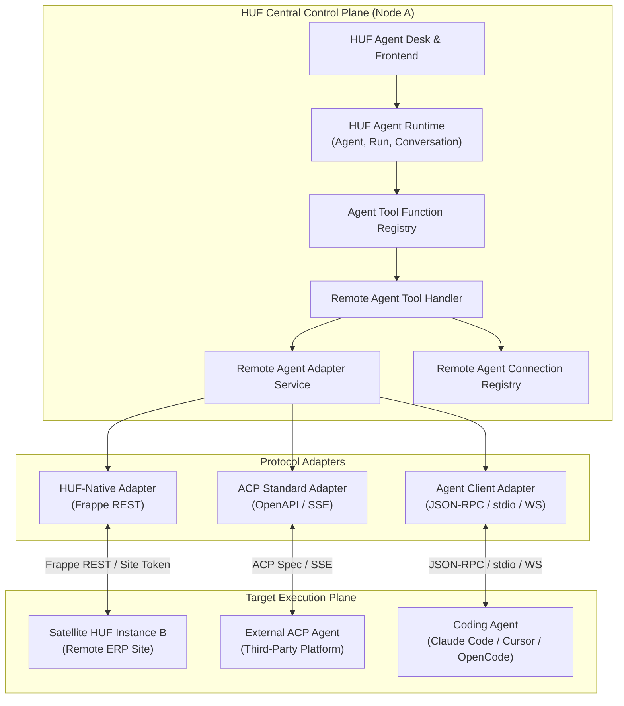
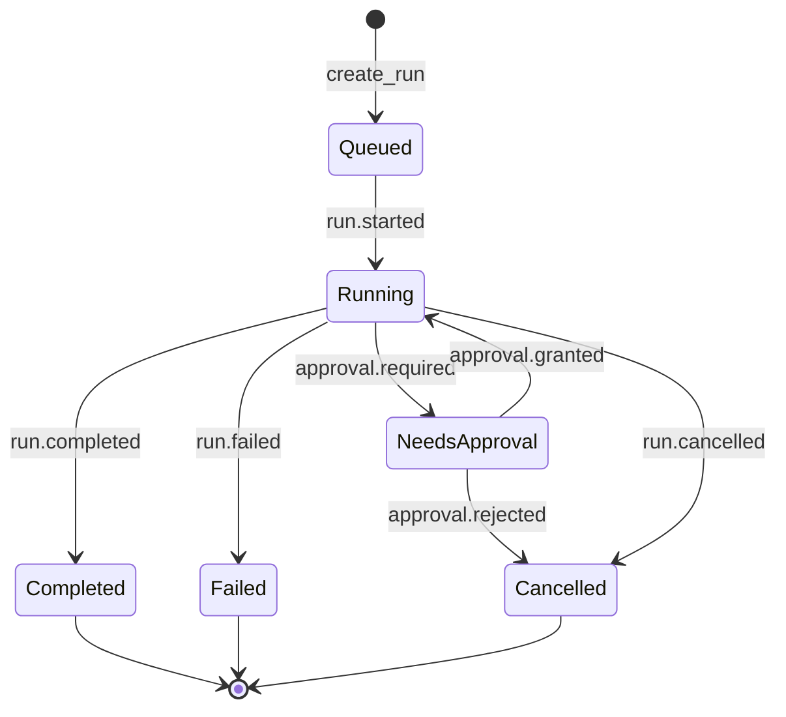
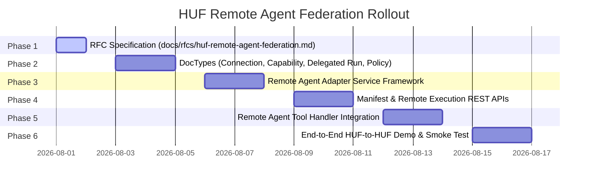

# RFC: HUF Remote Agent Federation Protocol & Runtime Specification

- **Status**: Proposed / Draft (Phase 1 Specification)
- **Author**: HUF Architecture Team
- **Created**: 2026-08-01
- **Target Version**: V1.0
- **RFC File**: `docs/rfcs/huf-remote-agent-federation.md`

---

## 1. Executive Summary

HUF serves as the Frappe-native AI control plane, orchestrating AI agents, tool calls, workflow triggers, scoped memory, and enterprise data models within Frappe. To support interoperability with external agent ecosystems (e.g., ACP-compliant external tools), editor/IDE coding agents (e.g., Claude Code, Cursor, OpenCode), and satellite HUF nodes without altering or replacing HUF's native internal state machine, HUF introduces an **Adapter-based Remote Agent Federation** model.

Under this architecture:
> **HUF remains the Frappe-native AI control plane.** Protocols such as Agent Communication Protocol (ACP), Agent Client Protocol, and HUF-Native Federation act as adapter boundaries for calling remote agents, exposing local HUF agents, and linking satellite HUF instances.

This specification documents Phase 1 of the federation roadmap, detailing protocol positioning, V1 scope boundaries, new Frappe DocTypes, REST APIs, the normalized event lifecycle, security governance rules, and a two-node demo rollout plan.

---

## 2. Protocol Positioning & Framing

There are distinct protocol standards in the modern AI ecosystem. HUF positions itself cleanly across each boundary without conflating their roles:

| Protocol | Purpose & Target Domain | HUF Architectural Role |
| :--- | :--- | :--- |
| **Model Context Protocol (MCP)** | Tool, resource, and prompt access between host and server. | HUF acts as an MCP client today (consuming external MCP tools). MCP server/gateway functionality remains a separate service boundary. |
| **Agent Communication Protocol (ACP)** | High-level agent-to-agent interoperability via RESTful APIs, manifests, async runs, streaming, and sessions. | Supported via an adapter for delegating tasks to external ACP-compliant agents and exposing select HUF agents to external orchestrators. |
| **Agent Client Protocol** | IDE / Editor to coding agent protocol (e.g., Claude Code, Cursor, OpenCode, Codex). | Supported via an adapter for delegating code manipulation tasks, terminal command execution, and workspace diff reviews. |
| **HUF-Native Federation Protocol** | High-efficiency node-to-node protocol between HUF instances. | Native Frappe REST protocol preserving full Frappe session context, granular permission policies, and audit correlation IDs across nodes. |

```text
               +----------------------------------------+
               |        HUF Core Engine (Desk/DocTypes)  |
               +-------------------+--------------------+
                                   |
                     [Remote Agent Adapter Layer]
                                   |
         +-------------------------+-------------------------+
         |                         |                         |
         v                         v                         v
+------------------+     +-------------------+     +--------------------+
|   HUF-Native     |     |   ACP Standard    |     |    Agent Client    |
|   Federation     |     |     Adapter       |     |  Protocol Adapter  |
+--------+---------+     +---------+---------+     +----------+---------+
         |                         |                        |
         v                         v                        v
+------------------+     +-------------------+     +--------------------+
| Remote HUF Node  |     | External ACP Agent|     | Local/Remote IDE   |
| (Satellite / ERP)|     |    (Third-Party)  |     |   Coding Agent     |
+------------------+     +-------------------+     +--------------------+
```

---

## 3. System Architecture Diagram

The system architecture cleanly separates local agent execution from remote delegation:



---

## 4. V1 Implementation Scope

To ensure a rapid, high-quality, and robust initial rollout, V1 focuses on establishing the core federation primitives and proving HUF-to-HUF delegation.

### 4.1 In-Scope (V1)
1. **Remote Connection Registry**: A dedicated `Remote Agent Connection` DocType to store endpoints, transport settings, credentials, and cached manifests.
2. **Normalized Remote Capability Cache**: A `Remote Agent Capability` child/related table caching capabilities advertised by remote agents.
3. **HUF-Native Adapter**: Complete Python adapter layer for calling and exposing remote agents between HUF instances.
4. **Manifest & Remote Run REST APIs**: Standardized server methods for listing exposed agents and managing remote agent runs (`create_run`, `get_run`, `get_run_events`, `cancel_run`).
5. **`Remote Agent` Tool Type**: Extending `Agent Tool Function` types so any local HUF agent can invoke a remote agent as a standard tool call.
6. **Delegated Run Audit Trail**: A durable `Delegated Agent Run` DocType linking local `Agent Run` instances to remote executions with status and response tracking.
7. **Security & Governance Controls**: SSRF protection (blocking private IPs by default), credential masking in logs/REST APIs, role/user capability policies, and execution timeouts.

### 4.2 Out-of-Scope (Deferred to V2+)
- Public multi-tenant agent registry or dynamic service-mesh discovery.
- OAuth 2.0 PKCE / OIDC flow UI (V1 uses API Keys, Site Tokens, or Bearer Passwords).
- Complex coding-agent workspace diff UI and file tree synchronization.
- Direct Visual Flow Builder drag-and-drop nodes for remote agents (handled seamlessly via standard `Remote Agent` tools in V1).
- Real-time WebSocket/SSE streaming infrastructure (V1 uses cursor-based polling with synchronous fallback).

---

## 5. Backend Schema & DocType Definitions

### 5.1 Remote Agent Connection (`Remote Agent Connection`)
Stores endpoint connections, transport configurations, authentication credentials, and diagnostic metadata.

- **Module**: `huf`
- **DocType Name**: `Remote Agent Connection`

| Fieldname | Field Type | Label | Options / Rules | Description |
| :--- | :--- | :--- | :--- | :--- |
| `connection_name` | Data | Connection Name | **Required**, Primary Key | Unique user-facing identifier. |
| `protocol_type` | Select | Protocol Type | `huf_native` (default)<br>`agent_communication_protocol`<br>`agent_client_protocol` | Protocol standard used by target endpoint. |
| `transport` | Select | Transport Mode | `http` (default)<br>`websocket`<br>`stdio` | Network transport mode. |
| `base_url` | Data | Base URL | Required if transport is `http` or `websocket` | Base endpoint URL (e.g. `https://erp.site.com`). |
| `stdio_command` | Small Text | Stdio Command | Optional | Command string for local stdio coding agents. |
| `auth_type` | Select | Auth Type | `none`<br>`bearer_token`<br>`site_token`<br>`api_key` | Authentication mechanism. |
| `auth_secret` | Password | Auth Secret | Encrypted | API key, token, or password. Excluded from JSON APIs. |
| `enabled` | Check | Enabled | Default: `1` | Operational toggle to enable/disable connection. |
| `allow_local_network` | Check | Allow Local Network | Default: `0` | If checked, bypasses SSRF loopback/private IP block. |
| `health_status` | Select | Health Status | `Unknown` (default)<br>`Healthy`<br>`Degraded`<br>`Failed` | Diagnostics status auto-updated on health check. |
| `last_health_check` | Datetime | Last Health Check | Read-only | Timestamp of most recent ping/manifest refresh. |
| `manifest_json` | JSON | Cached Manifest | Read-only | Cached JSON manifest from remote agent endpoint. |
| `last_error` | Small Text | Last Error Log | Read-only | Diagnostic error log from last failed attempt. |

---

### 5.2 Remote Agent Capability (`Remote Agent Capability`)
Normalized local record of capabilities offered by a specific remote agent connection.

- **Module**: `huf`
- **DocType Name**: `Remote Agent Capability`

| Fieldname | Field Type | Label | Description |
| :--- | :--- | :--- | :--- |
| `connection` | Link | Connection | Link to parent `Remote Agent Connection`. |
| `remote_agent_id` | Data | Remote Agent ID | Opaque agent ID specified by remote host. |
| `display_name` | Data | Display Name | Human-readable title of the remote agent. |
| `description` | Small Text | Description | Functional summary from remote manifest. |
| `input_modes` | JSON | Input Modes | Supported content formats (e.g., `["text/markdown", "application/json"]`). |
| `output_modes` | JSON | Output Modes | Supported response formats. |
| `capabilities` | JSON | Capabilities | Declared feature tags (e.g., `["chat", "knowledge_search"]`). |
| `stateful` | Check | Stateful | Indicates if target supports session continuity. |
| `long_running` | Check | Long Running | Indicates support for asynchronous execution. |
| `supports_streaming` | Check | Supports Streaming | Indicates support for incremental chunk updates. |
| `enabled_for_delegation` | Check | Enabled for Delegation | Local gate allowing HUF agents to invoke this capability. |

---

### 5.3 Delegated Agent Run (`Delegated Agent Run`)
Tracks the execution lifecycle of a local run delegated to a remote agent.

- **Module**: `huf`
- **DocType Name**: `Delegated Agent Run`

| Fieldname | Field Type | Label | Options / Rules | Description |
| :--- | :--- | :--- | :--- | :--- |
| `local_agent_run` | Link | Local Agent Run | Link to `Agent Run` | Parent local run initiating the delegation. |
| `connection` | Link | Remote Connection | Link to `Remote Agent Connection` | Target connection used for delegation. |
| `remote_agent_id` | Data | Remote Agent ID | Data | Remote agent identifier. |
| `remote_run_id` | Data | Remote Run ID | Data | Remote run reference ID returned by endpoint. |
| `remote_session_id` | Data | Remote Session ID | Data | Remote session reference if stateful. |
| `status` | Select | Status | `queued`<br>`running`<br>`needs_approval`<br>`completed`<br>`failed`<br>`cancelled`<br>`timeout` | Current state of delegated execution. |
| `started_at` | Datetime | Started At | Datetime | Local timestamp when delegation was dispatched. |
| `completed_at` | Datetime | Completed At | Datetime | Local timestamp when run reached terminal state. |
| `request_json` | JSON | Request Payload | JSON (Redacted) | Sanitized request payload sent to remote node. |
| `response_json` | JSON | Response Data | JSON | Normalized response payload or event summary. |
| `event_cursor` | Data | Event Cursor | Data | Polling cursor mark for incremental updates. |
| `error` | Small Text | Error Log | Small Text | Redacted error description if execution failed. |

---

### 5.4 Remote Agent Policy (`Remote Agent Policy`)
Controls which local agents and roles may delegate actions to remote connections, along with operational limits.

- **Module**: `huf`
- **DocType Name**: `Remote Agent Policy`

| Fieldname | Field Type | Label | Description |
| :--- | :--- | :--- | :--- |
| `connection` | Link | Connection | Target `Remote Agent Connection`. |
| `allowed_agents` | JSON | Allowed HUF Agents | List of local HUF Agent names authorized to call this connection. Empty = all permitted. |
| `allowed_roles` | JSON | Allowed Roles | System user roles authorized to initiate delegation. |
| `max_timeout_seconds` | Int | Max Timeout (Sec) | Wall-clock timeout limit (Default: `120`). |
| `max_tokens` | Int | Max Tokens Limit | Upper bound on token budget sent in request hints. |
| `allow_files` | Check | Allow File Transmission | Controls whether file attachments can be sent to target. Default: `0`. |
| `requires_human_approval` | Check | Force Human Approval | Halts execution until a local user approves the action. Default: `0`. |
| `audit_level` | Select | Audit Logging Level | Options: `metadata`, `messages`, `messages_and_events`. |

---

## 6. Proposed V1 APIs

### 6.1 HUF Agent Manifest & Discovery API
Exposes allowlisted local HUF agents to remote callers or peer HUF nodes.

```text
GET /.well-known/huf-agent.json
GET /api/method/huf.api.remote_agents.list_agents
GET /api/method/huf.api.remote_agents.get_agent_manifest
```

#### Sample Response (`/.well-known/huf-agent.json`)
```json
{
  "server_name": "Dubai Operations HUF Node",
  "protocol_versions": ["huf-native-v1"],
  "agents": [
    {
      "id": "erp_support_agent",
      "name": "ERP Support Agent",
      "description": "Answers ERP support queries, checks order status, and generates support tickets.",
      "input_modes": ["text/markdown", "application/json"],
      "output_modes": ["text/markdown", "application/json"],
      "capabilities": ["chat", "knowledge_search", "ticket_create"],
      "stateful": true,
      "long_running": true,
      "streaming": true
    }
  ]
}
```

---

### 6.2 Remote Run Management API
Allows federated callers to initiate, poll, monitor, and cancel agent runs.

```text
POST /api/method/huf.api.remote_agents.create_run
GET  /api/method/huf.api.remote_agents.get_run
GET  /api/method/huf.api.remote_agents.get_run_events
POST /api/method/huf.api.remote_agents.cancel_run
```

#### Request Payload (`create_run`)
```json
{
  "agent_id": "erp_support_agent",
  "prompt": "Check status of Purchase Order PO-2026-0089 and summarize line item delays.",
  "session_id": "session_conv_12345",
  "parameters": {
    "include_supplier_details": true
  }
}
```

#### Response Payload (`create_run`)
```json
{
  "status": "success",
  "data": {
    "run_id": "run_huf_remote_98765",
    "status": "running",
    "started_at": "2026-08-01 03:30:00"
  }
}
```

---

### 6.3 Local Delegation Tool (`Remote Agent` Tool Type)
Integration into HUF's existing tool function architecture by registering `Remote Agent` as a native Tool Type in `Agent Tool Function`.

#### Tool Input Schema (Passed by Local Calling Agent)
```json
{
  "remote_agent": "erp_support_agent",
  "task": "Retrieve outstanding balance for Customer CUST-4029 and check active tickets.",
  "context": {
    "conversation_id": "conv_88123",
    "reference_doctype": "Sales Order",
    "reference_name": "SO-2026-0012"
  }
}
```

#### Tool Output Schema (Returned to Local Calling Agent)
```json
{
  "status": "completed",
  "remote_run_id": "run_huf_remote_98765",
  "content": "Customer CUST-4029 has an outstanding balance of $3,450.00 across 2 unpaid invoices. No open critical support tickets.",
  "events_summary": [
    {"event": "run.started", "timestamp": "2026-08-01T03:30:00Z"},
    {"event": "tool.completed", "tool_name": "get_customer_invoices", "timestamp": "2026-08-01T03:30:02Z"},
    {"event": "run.completed", "timestamp": "2026-08-01T03:30:03Z"}
  ]
}
```

---

## 7. Event Model

All remote execution events are translated into a standardized, internal event lifecycle:



### Event Specification Table

| Event Type | Category | Meaning & Trigger | Payload Attributes |
| :--- | :--- | :--- | :--- |
| `run.started` | Lifecycle | Remote execution accepted and initialized by host. | `run_id`, `timestamp` |
| `message.delta` | Stream | Incremental response text chunk. | `chunk`, `delta_index` |
| `message.completed` | Message | Full user/assistant/tool message block finalized. | `role`, `content`, `tokens` |
| `tool.started` | Tool | Remote agent initiated a local/external tool execution. | `tool_name`, `tool_args` |
| `tool.completed` | Tool | Remote tool execution finished successfully. | `tool_name`, `status`, `result_summary` |
| `approval.required` | Governance | Remote run paused pending human confirmation. | `action_id`, `reason`, `preview` |
| `run.completed` | Lifecycle | Run reached successful terminal state. | `final_content`, `total_tokens`, `cost` |
| `run.failed` | Error | Execution aborted due to unhandled error. | `error_code`, `message` |
| `run.cancelled` | Lifecycle | Execution aborted via caller request or timeout. | `cancelled_by`, `timestamp` |

---

## 8. Security & Governance Rules

Remote agent delegation establishes cross-boundary communication. Strict security controls are enforced:

1. **Explicit Permission Gating**: Remote calls are gated by Frappe's permission system. Calling agents operate under the permissions of the initiating user or explicit API key context.
2. **SSRF & Private IP Protection**:
   - Remote target URLs undergo strict network resolution checks.
   - Outbound connections to private IP spaces (RFC 1918: `10.0.0.0/8`, `172.16.0.0/12`, `192.168.0.0/16`) and loopback (`127.0.0.1`, `::1`) are **blocked by default**, unless `allow_local_network` is explicitly set on the `Remote Agent Connection`.
3. **Secret Storage & Redaction**:
   - Authentication tokens/keys are stored solely in Frappe `Password` fields or `site_config.json`.
   - Headers containing `Authorization`, `Bearer`, `Cookie`, or API keys are stripped prior to logging requests in `Delegated Agent Run` or system traces.
4. **Strict Request Timeouts**: Remote executions enforce `max_timeout_seconds` (default: 120s) to safeguard local WSGI/Gunicorn workers against hanging connections.
5. **Untrusted Input Treatment**: Remote manifests and agent responses are validated against strict JSON schemas before being parsed by internal handlers.
6. **Approval Controls**: Actions with side effects (document creation, updates, deletes) can be forced into a `needs_approval` state based on `Remote Agent Policy`.

---

## 9. Rollout Roadmap & Demo Plan

### 9.1 Phase Breakdown & PR Plan



| PR Sequence | Target Scope | Key Deliverables | Risk Level |
| :--- | :--- | :--- | :--- |
| **PR 1 (Current)** | RFC Specification | `docs/rfcs/huf-remote-agent-federation.md` | Low |
| **PR 2** | Connection & Schema | `Remote Agent Connection`, `Capability`, `Delegated Agent Run`, `Policy` DocTypes | Medium |
| **PR 3** | Adapter Layer | `huf/ai/remote_agents/` Python package & mock adapter test suite | Medium |
| **PR 4** | Exposed Manifest & Run API | `huf/api/remote_agents.py` REST API endpoints | Medium-High |
| **PR 5** | Tool Integration | `Remote Agent` Tool Type handler in `huf/ai/sdk_tools.py` | High |
| **PR 6** | E2E Demo & Validation | Demo scripts, integration test suite, documentation update | Medium |

---

### 9.2 End-to-End HUF-to-HUF Demo Plan (Phase 6)

The demonstration will feature two local HUF bench sites:

- **HUF Central (Node A)**: `http://localhost:8000` (Main Orchestration Plane)
- **HUF Satellite (Node B)**: `http://localhost:8001` (ERP Operations Node)

#### Step-by-Step Scenario
1. **Setup**:
   - Node B configures and allowlists `erp_support_agent`.
   - Node A creates a `Remote Agent Connection` pointing to `http://localhost:8001` with `allow_local_network=1` and credentials.
   - Node A clicks **Refresh Manifest**; `Remote Agent Capability` records automatically populate Node B's advertised capabilities.
2. **Delegation Execution**:
   - User opens Node A Agent Chat and prompts the Orchestration Agent: *"Ask the ERP Support Agent on Node B to inspect stock for item ITEM-9901 and report any pending purchase orders."*
   - Node A Orchestration Agent selects the `Remote Agent` tool configured for Node B.
   - Node A creates a local `Delegated Agent Run` record, then dispatches a POST request to Node B's `/api/method/huf.api.remote_agents.create_run`.
   - Node B receives the request, executes its local `Agent Run`, queries MariaDB, and returns the result.
   - Node A receives the response payload, updates `Delegated Agent Run` to `completed`, and streams the final synthesis back to the user.
3. **Audit Verification**:
   - Inspect `Delegated Agent Run` on Node A to verify correlation between `local_agent_run` and `remote_run_id`.
   - Verify secrets were masked and non-permitted actions were rejected.
4. **Negative Case Testing**:
   - Temporarily disable Node B connection or alter permission policy on Node A. Verify that Node A Orchestration Agent handles tool error gracefully without throwing an unhandled exception.

---

## 10. References & Further Reading

- [Agent Communication Protocol (ACP) Specification](https://agentcommunicationprotocol.dev/introduction/welcome)
- [Agent Client Protocol Specification](https://agentclientprotocol.com/get-started/architecture)
- [Model Context Protocol (MCP) Overview](https://modelcontextprotocol.io/)
- [HUF Repository & System Prompts](../../AGENTS.md)
